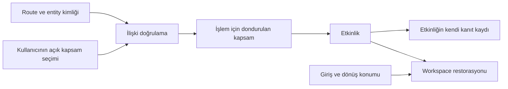
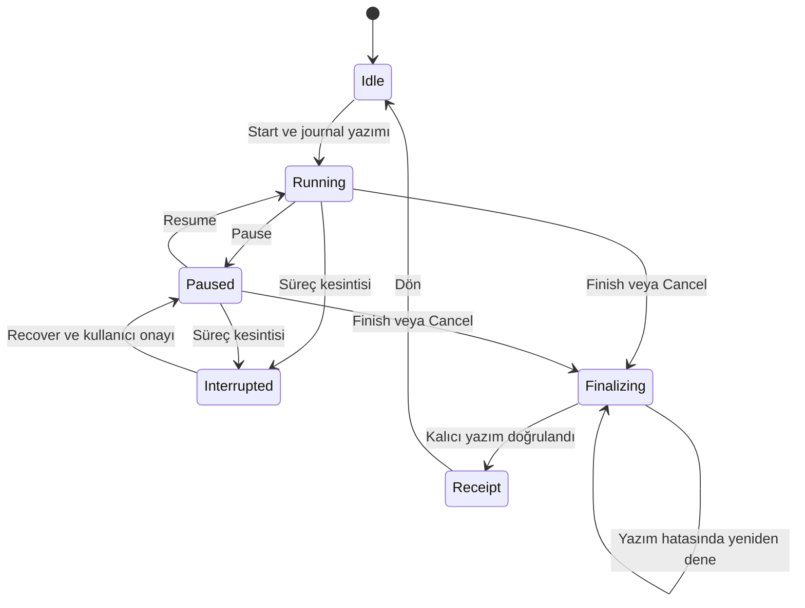
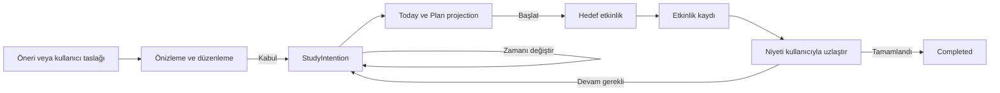
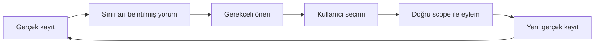

# MedOS Final Architecture

**Belge:** MEDOS FINAL ARCHITECTURE  
**Tarih:** 10 Eylül 2026  
**Kapsam:** Ürün, UX sistemleri, bilgi mimarisi ve veri gereksinimlerinin nihai sentezi. Uygulama, şema değişikliği, Figma düzenlemesi veya yeni ekran tasarımı değildir.  
**Referans baseline:** Sağlanan Phase 12 / schema v14 belgeleri. Mevcut çalışma ağacının yeni bir kod denetimi yapılmamıştır.

## 1. Executive Architecture Thesis

MedOS, öğrencinin çalışmayı seçtiği, akademik bağlam içinde farklı etkinliklere geçtiği ve güvenilir kayıtlara bakarak sonraki adımını ayarladığı tek bir çalışma sistemidir. **Today · Study · Review · Plan**, ortak çalışma alanını ve aynı bağlam sözleşmesini kullanır; gezinme geçmişi, çalışma kapsamı ve tarihsel kanıt birbirinin yerine geçmez. AI yardımcı olur, plan niyeti saklar, etkinlik kendi gerçek kaydını üretir; öğrenme hakkında yalnızca bu kaydın desteklediği yorum yapılır.

Nihai karar, bir adayın bütününü seçmek değildir. Track A'dan sorumluluk ayrımı ve materyal yaşam döngüsü, Track B'den global çalışma ve tarihsel atıf güvenliği, Track C'den ortak eylem dili, AI yetki ayrımı ve cihaz rolleri korunmuştur. Büyük şema dönüşümü, zorunlu Topic sahipliği, bağımsız AI ürünü ve desteklenmeyen hazırlık yüzdeleri çıkarılmıştır.

İlk tasarım kapsamı, mevcut etkinlikleri birleştiren çalışma deneyimidir. Kalıcı çalışma niyeti küçük bir gelecekteki veri genişlemesi olarak tanımlanır; kalıcı Question Player ilk kapsamın dışındadır. Mimari seçimleri bu belgede yapılmıştır; bu seçimler uygulama veya migration yetkisi değildir.

## 2. Source Inventory and Evidence Boundaries

### 2.1 Gerçekte bulunan kaynaklar

Dosyalar aşağıdaki dört klasörde bulundu ve kaynak olarak salt okunur kullanıldı:

- `C:/Users/ismet/OneDrive/Paylaşılan sık kullanılanlar/Desktop/Track_A/`
- `C:/Users/ismet/OneDrive/Paylaşılan sık kullanılanlar/Desktop/Track_B/`
- `C:/Users/ismet/OneDrive/Paylaşılan sık kullanılanlar/Desktop/Track_C/`
- `C:/Users/ismet/OneDrive/Paylaşılan sık kullanılanlar/Desktop/Ek_Kaynak/`

| Kaynak kodu | Dosya | Track / rol | Okunabilirlik ve inceleme sınırı |
| --- | --- | --- | --- |
| A | `medos_phase_13b_blueprint.md` | Track A, ayrıntılı hedef mimari şartnamesi, Final QA Revision | Tam metin okunabilir; A–AL bölümleri incelendi. Birincil kaynak. |
| B | `PHASE13B_CODEX_ARCHITECTURE.md` | Track B, ayrıntılı hedef mimari şartnamesi | 24 bölümün tamamı okunabilir ve incelendi. Birincil kaynak. |
| BP | `MedOS_Track_B_Study_Continuity_Architecture.pptx` | Track B, niyet ve ilişkileri özetleyen sunum | 28 slaydın metni okunabilir ve incelendi. Slaytların grafik yerleşimine veya animasyonlarına ilişkin görsel denetim yapılmadı; metinsel ilişkiler yardımcı kanıt olarak kullanıldı. |
| C | `MedOS_Track_C_Dual_Layer_Architecture.pdf` | Track C, hedef mimari belgesi | 16 sayfanın tamamının metni okundu; tüm sayfaların render edilmiş görünümleri de incelendi. Birincil kaynak. |
| BC | `PHASE13_CODEX_CONTEXT.md` | Paylaşılan Phase 12 baseline / alt sistem haritası | 18 bölüm tam okunabilir ve incelendi; güncel kod denetimi yerine belge kanıtı. |
| BA | `PHASE13A_CODEX_AUDIT.md` | Track B öncesi mevcut durum UX denetimi | Tam okunabilir ve incelendi; on kaynak dosyaya dayanan sınırlı statik denetimin raporu. |
| AA | `MedOS_Phase_13A_Clean_Report.pdf` | Track A öncesi mevcut durum denetimi / temiz devir raporu | 21 sayfanın tamamının metni okunabilir ve incelendi. Sayfa düzeni görsel olarak denetlenmedi; içerik ve sayfa atıfları için kullanıldı. |
| AI1 | `Track_A_Ekran_Envanteri_Sohbet_Alintisi.md` | Track A, önceki 50 maddelik hedef yüzey listesi | Tam okunabilir. Ekran, form, mod ve durumları aynı listede sayar; hedef ekran sayımızı belirlemez. |
| AI2 | `Track_A_Figma_Ekran_Envanteri.md` | Track A, raporlanmış Figma frame envanteri | 100 satırlık envanter okunabilir: 50 mobil, 50 tablet. İsim/boyut/link kanıtıdır; bu çalışmada canlı Figma veya ekran görselleri incelenmedi. |
| BI | `Track_B_Ekran_Envanteri_Belgeden_Alinti.md` | Track B, B §19'un tekrar alıntısı | Tam okunabilir; bağımsız doğrulama veya üretilmiş tasarım seti değildir. |
| CI1 | `Track_C_Ekran_Envanteri_PDF_Alintisi.txt` | Track C, PDF s.13–14 §18 metin alıntısı | Tam okunabilir; PDF'nin tekrarından ibarettir. |
| CI2 | `Track_C_Figma_Ekran_Envanteri.md` | Track C, raporlanmış sonraki Figma envanteri | 64 satır okunabilir: 32 mobil, 32 tablet. PDF'deki T3 kodlarıyla sonraki C-M/C-T kodları aynı sürüm kabul edilmedi. |
| E | `MedOS_Architecture_Tracks_Progress_Intelligence.pptx` | Önceki kavramsal alternatifler / destek sunumu | 30 slaydın metni okunabilir ve incelendi. Grafik yerleşimi denetlenmedi. A/B/C için birincil mimari kanıt değildir. |

**Birincil mimari kaynağı eksik değildir.** Üç track arasında belge düzeyinde tam sentez yapılabilir. Ancak bu, uygulama veya Figma tasarımlarının tam karşılaştırmalı denetimi değildir. Ayrı ekran görüntüleri/exports bu dört klasörde bulunmadı; envanter linklerinden ekran yerleşimi çıkarılmadı. Track C için PDF'den daha ayrıntılı veri sözleşmesi bulunmaması, özellikle migration ve recovery değerlendirmesinin kesinliğini azaltır; hayali ayrıntılarla tamamlanmaz.

### 2.2 Atıf ve öncelik yöntemi

Bu belgedeki `A §W` gibi kısa atıflar yukarıdaki tam dosya adına gönderme yapar. Örneğin `A §W Flashcard / Review Architecture`, `medos_phase_13b_blueprint.md` dosyasının ilgili başlığıdır. `C s.8 §9 Learn` PDF sayfasını ve başlığını; `BP sl.13 Review / Flashcards` sunum slaydını belirtir. Bölüm numarası bulunmayan BA için başlık adı kullanılır.

1. Hedef kararlar için ayrıntılı şartname, sonra sunum özeti kullanılır.
2. Mevcut davranış için hedef şartname yerine BC ve denetimler kullanılır. BA'nın açık, dosya temelli düzeltmeleri BC'nin genel ekran tariflerine üstün gelir. AA'nın daha ayrıntılı olduğu ingestion konuları, AA'ya atıfla belge bulgusu olarak korunur.
3. Envanter bir yüzeyin önerildiğini veya listelendiğini gösterir; çalıştığını, erişilebilirliğini veya görsel yerleşimini ispatlamaz.
4. Kaynak içindeki “şimdi temizle”, “migration yap”, “mimari hazır” ifadeleri kaynak sahibinin önerileridir. Bu göreve talimat veya işlem yetkisi sayılmadı.
5. Bu çalışmada repository okunup yeniden doğrulanmadı. **Verified existing**, aşağıda açıkça belirtildiği üzere sağlanan mevcut-durum belgelerinde doğrulanmış anlamındadır; 10 Eylül çalışma ağacında yeniden test edilmiş anlamına gelmez. Canlı provider, fiziksel cihaz ve kullanıcı testi sonucu üretilmedi.

### 2.3 Kaynaklar arasındaki önemli uyuşmazlıklar

| Uyuşmazlık | Kaynaklar | Nihai çözüm |
| --- | --- | --- |
| Yedi görünür sekme mi, beş mi? | AA s.2–4 yedi tab ailesini primary diye sayar; BA Navigation Findings beş görünür, AI/Profile gizli der. | Baseline görünürlüğünde BA esas: Dashboard, Committees, Focus, Memory, Calendar görünür; yedi route ailesi yedi görünür sekme değildir. |
| AI bağımsız sohbet mi? | BC §3 öyle adlandırır; BA AI ve E9 Topic seçici olduğunu doğrular. | Baseline AI launcher, genel sohbet değildir. C'nin AI Home'u gelecek önerisidir. |
| Hiç bağlam taşınmıyor mu? | A §A/C geniş bir kayıp iddiası kurar; BA Academic Context Findings ve AA s.7–9 Topic → Focus gibi geçişleri doğrular. | Sorun bağlamın yokluğu değil, girişlere göre eşitsizliği ve materyal geçişlerindeki kopuktur. |
| `flashcards.topic_id` yeni mi? | A §W/AJ yeni alan önerir; BC §7 ve AA s.7 var olan optional linki bildirir. | Alanı yeniden eklemek, NOT NULL yapmak ve Deck'ten Topic tahmin etmek reddedilir. |
| Deck optional olabilir mi? | A §W hedefi bunu ister; AA s.20 mandatory Deck, B §11 mevcut depolama gereğini korur. | Deck mevcut depolama koleksiyonu olarak kalır; Topic bağımsız optional akademik bağdır. |
| “Back = origin” her yerde korunuyor mu? | A §M geçmiş der; §T/Z assistant için “Back = Topic” yazar. | Materyalden Ask açıldıysa dönüş materyaledir. Up Topic'e gider; ana kural istisnasızdır. |
| Mastery yüzdesi var mı / gerekli mi? | C s.6–11 ve E sl.6,25 önerir; A §Y sahte yüzdeleri reddeder; BC §11 kategorik mastery heuristikleri tarif eder. | Kategorik hesap varlığı geçerlilik kanıtı değildir. Ham metrikler korunur; mastery/readiness yüzdeleri ve sert yeterlik etiketleri kullanılmaz. |
| Planning bozukluğu doğrulanmış mı? | BP sl.3 kesin kopukluk dili kullanır; BA Planning / Calendar ortak yaşam döngüsünün doğrulanmadığını söyler. | Birleşik yaşam döngüsü eksik/kanıtsız kabul edilir; yeniden üretilmiş senkronizasyon hatası iddia edilmez. |
| Tablet tek 620dp mi? | BC §3 genel sınır verir; BA Mobile vs Tablet Findings istisnaları kaydeder. | Bazı responsive düzenler vardır; eşzamanlı reader+AI doğrulanmamıştır. |

**Adlandırma sınırı:** E'deki Track 1 = Command Center, Track 2 = Academic Workspace OS, Track 3 = Dual-Layer MedOS. Bunlar Track A/B/C değildir. C s.15'te B'ye ilişkin geleceğe dönük tanım, eldeki B şartnamesinin yerine geçirilmez.

## 3. What We Learned From Track A

### 3.1 Bağımsız mimari değerlendirme

Track A'nın tezi, Topic'i ana akademik workspace yapıp Focus, Practice ve Review'u bağlamsal etkinliklere dönüştürmektir. Öğrencinin “sınavım, çalıştığım konu, yapacaklarım, ilerlemem, çalışma eylemim” şeklinde beş kavram öğrenmesini ister. Today · Study · Plan · Progress kararı A §D, K–L'de açıktır.

| Boyut | Güçlü karar | Zayıflık / gereksiz karmaşıklık / sonuç |
| --- | --- | --- |
| Ürün ve zihinsel model | Academic hierarchy'yi koruyup Topic çevresinde araçları birleştirir. | “Her şey bir sınava aittir” ve tek aktif sınav varsayımı bağımsız/cross-topic çalışmayı daraltır. Bir sınavın geçmiş olması tamamlanmış öğrenme değildir. A §D–F. |
| Navigasyon | Dört niyet alanı; Profile sekme olmaktan çıkar; Back/Up ayrılır. | Review ve Deck yönetiminin Topic altında konumlanması global koleksiyonları bulmayı zorlaştırır. Assistant dönüş kuralı kendi Back ilkesiyle çelişir. A §K–M, T, Z. |
| Akademik bağlam | Route'u context store'dan üstün tutması doğru; picker sheet tekrar traversal'ı azaltır. | Son Topic'in Today Focus için otomatik önseçimi sürpriz atıf oluşturabilir. Focus/Task için zorunlu Committee, global çalışma gereksinimini karşılamaz. A §J/U. |
| Today | Tek güçlü eylem, plan ve küçük snapshot kolay anlaşılır. | Zone 2; Task, event, kabul edilmemiş AI item, due ve milestone birikimiyle kalabalıklaşır. Aynı niyet birden çok satır olabilir. A §O/X. |
| Topic | Overview / Materials / Practice / Memory net yerel sorumluluklar sunar. | Overview aynı anda görev, analytics, AI, recent activity ve Study Now taşır. “Study Now”un Focus mu due review mu olduğu değişkendir. A §R. |
| Materials | Oluşturma sonrası indeksleme ve provenance boşluğunu somut ele alır. | “Indexed” rozeti öğrenen için teknik; otomatik ingestion başarısını henüz kanıtlamaz. Sayfa/selection/resume sözleşmesi yetersizdir. A §S; AA s.11. |
| Focus | Tek etkinlik ve lifecycle checkpoint önerisi anlamlıdır. | Dört saatlik restore ve saat farkından süre hesaplama belirsiz process-death aralığını çalışma sayabilir; idempotency ayrıntısı yoktur. Recovery riski LOW sınıflaması iyimserdir. A §U/AG. |
| Review ve Deck | Tek ReviewSession, global/Topic/Deck girişleri ve tarihsel veriye ihtiyat niyeti iyi. | Topic ownership migration'ı baseline'ı yanlış okur; tek Topic bulunan Committee'den geçmiş ilişki tahmini güvenilir değildir. Çok sayıda review entry mode erken uzmanlaşmadır. A §I/W. |
| Questions | External log korunur; Question/Attempt ayrımı gelecekte anlamlıdır. | Soru bankasını ürünün zorunlu tamamlayıcısı ilan ederek version, kalite ve migration maliyetini küçümser. Tablo rename continuity iyileştirmesinin önkoşulu değildir. A §G/V. |
| AI | Kullanıcı incelemesiyle kalıcı kart/soru yolu; Topic ve Material girişi güçlü. | Tüm değerli çıktıları veri nesnesine dönüştürme ilkesi StudyPlan + Item + Task zincirini büyütür. Genel Ask yolu zayıftır. A §B/T. |
| Planning | Task ne yapılacağını, CalendarEvent ne zaman yapılacağını sahiplenir; completion yalnızca Task'tadır. | StudyPlanItem dönüşüm durumu, Task completion ve calendar projection üç ayrı senkronizasyon yüzeyi yaratır. A §H/X. |
| Progress | Raw evidence ve ağırlıklı hesapları korur; ayrıntılar görünürdür. | “Weak/neglected” algoritmalarını aynen korumak, etiketlerin kullanıcıya ne söylediğini yeterince sorgulamaz. Progress'e sekme ayırmak günlük review erişimine göre düşük önceliktedir. A §Y. |
| Telefon | Kısa formlar sheet, etkinlikler tek amaçlıdır. | Quick Action başlıkta, ana eylemler başparmak bölgesinde denirken erişim stratejisi tutarsızlaşır. Envanterde form ve state'ler gerçek ekranlarla karışır. A §AB; AI1. |
| Tablet | Academic sidebar, Material+AI ve Task+Calendar eşzamanlılığı somuttur. | Focus'u her durumda full-screen yapmak materyalle çalışma sürekliliğini keser. A §AC. |
| Uygulanabilirlik | Repository/service sorumluluklarını ve migration sırasını somutlaştırır. | Çok sayıda yeni tabloyu bütün ekranların önkoşulu yapar; yanlış baseline alanı ve gereksiz rename riski büyütür. A §AJ. |
| Ölçeklenebilirlik / parçalanma | Alan sahipleri belirgindir. | Topic'e taşınan her yeni mod, Topic içindeki mini-uygulama sayısını artırabilir; global işler görünmezleşebilir. |

**A'dan çıkarılan ders:** Veri yaşam döngüsü ve sahiplik açık olmalıdır; bunun için bütün domain'i yeniden kurmak gerekmez. Task/Calendar completion ayrımı korunur. Deck'in düşürülmesi, zorunlu akademik atıf ve toplu v15 dönüşümü korunmaz.

## 4. What We Learned From Track B

### 4.1 Bağımsız mimari değerlendirme

Track B'nin tezi “Study Continuity”dir: akademik kimlik eylemlerle taşınır, gezinme kanıt atfını belirlemez. Today · Study · Review · Plan, öğrencinin seçme, çalışma, tekrar etme ve plan ayarlama niyetlerini ayırır. B §1–5; BP sl.4,7.

| Boyut | Güçlü karar | Zayıflık / gereksiz karmaşıklık / sonuç |
| --- | --- | --- |
| Ürün ve zihinsel model | Global review ve unassigned çalışma açıkça birinci sınıftır. | “Workspace”, “scope”, “context record” kullanıcı diline aynen taşınırsa soyutlaşır. B §4/6. |
| Navigasyon | Review due workload için doğrudan bir ev, Plan ayrı sahip sunar. | Study hem discovery hem çalışma hem Progress erişimini taşır; sınırlandırılmazsa her şey burada birikir. B §5/24. |
| Akademik bağlam | Activity scope, route ve return ayrılır; stale/conflict kuralı kuvvetlidir. | Context'in ömrü, çoklu draft ve restoration öncelikleri uygulama düzeyinde zor; “UI/state only” kolaylık anlamına gelmez. B §6/22. |
| Today | Active work → accepted plan → due → corrective action sırası uygulanabilir. | Aktif timer, açık materyal ve taslak aynı anda varsa hangi resume'un baskın olduğu daha kesinleşmelidir. B §7. |
| Topic | Learn / Questions / Review modları, Focus kontrolü, Ask paneli tutarlı. | Her Topic açılışında son materyale otomatik dönmek, yeni bir amaçla Topic arayan kişiyi şaşırtabilir. Açık Topic ile Continue ayrılmalıdır. B §8. |
| Materials | Source, location, selection ve return koruma; desteklenmeyen page grounding'i iddia etmeme güçlüdür. | Minimum reader konumu ve structured provenance olmadan hangi vaatlerin kalacağı daha kesin tanımlanmalıdır. B §9. |
| Focus | Tek timer, frozen scope, checkpoint-only recovery, idempotent finalization. | Süre kaybı ile dürüst kayıt arasındaki bedel görünür kılınmalı; checkpoint periyodu ve journal depolama seçimi açık kalır. B §10/24. |
| Review / Deck | Count ve queue aynı snapshot; unlinked kartlar dışlanmaz; rating-time Topic snapshot korunur. | All due sınırsız hissedebilir; oturum sınırı seçeneği uygulama öncesi ürün kuralına bağlanmalıdır. B §11. |
| Questions | Aggregate logger ile AI draft ve gelecek Player net ayrılmıştır. | Kalıcı soruları ertelemek kaynak içinden çöz–yanlışına dön döngüsünü ilk sürümde eksik bırakır; bu eksiklik açıkça anlatılmalıdır. B §12. |
| AI | Tek assistant, grounding sınırı, preview ve provider/fallback ayrımı. | Genel ungrounded yardım başlangıçta dışarıda; global Ask yine scope seçimi gerektirir. Bunun keşfedilebilir bir giriş olması gerekir. B §13. |
| Planning | Intent completion ile etkinlik kaydını karıştırmaz; schema sınırlarını dürüstçe ayırır. | Dayanıklı Task'ı gelecek olarak bırakırken tam lifecycle'ı hedef anlatısında kullanır. Baseline ve hedef arayüz davranışı ayrıca etiketlenmelidir. B §14/22. |
| Progress | Metrik, sınırlılık ve eylem birbirine bağlıdır. | “Mastery/exam timing” satırı mevcut heuristikleri hâlâ taşır; yanlış anlaşılabilecek ana etiketlere daha açık ret gerekir. B §15. |
| Telefon | Global giriş, reachable controls, keyboard ve safe-area düşünülmüş. | Sheet sayısı büyürse üst üste form akışı oluşabilir; tek aktif editör sınırı belirtilmelidir. B §16/18. |
| Tablet | İki pane varsayılanı, gerektiğinde üçüncü pane, resize continuity. | Eşzamanlı panel bağlamı ile seçili Topic bağlamı farklılaştığında görünür kilitleme davranışı eksik ayrıntıdır. B §17. |
| Uygulanabilirlik | v14'le mümkün olanlar ve yeni veri gereksinimleri ayrılır. | Journal ve bookmark için “state-only” ifadesi dayanıklılık/versiyonlama işini hafif gösterebilir. B §22. |
| Ölçeklenebilirlik / parçalanma | Aynı etkinliğin bir motoru ve bir context contract'i vardır. | Progress, assistant ve recents için net surface bütçesi yoktur; envanter UI tasarımına doğrudan yetecek ayrıntıda değildir. B §19/24. |

**B'den çıkarılan ders:** En güçlü temel, mevcut veriyi bozmadan geçişleri düzeltmektir. Ancak “gelecekte gerekebilir” demekle yetinilmeyip minimum kalıcı niyet ve recovery sözleşmesi kesinleştirilmelidir. Topic açmak ile kaldığı yerden devam etmek ayrılır.

## 5. What We Learned From Track C

### 5.1 Bağımsız mimari değerlendirme

Track C, Academic Spine ile Action Layer'ı ayırır: “Ne çalışıyorum?” sabit kalırken “Ne yapıyorum?” değişebilir. Today · Study · AI önerisi PDF s.4 §4'te doğrulanmıştır. İki katman adı altında Progress Intelligence ve Planning Assist de tarif edilir; bunlar öğrenciye dört teknik katman olarak öğretilmemelidir. C s.3–4 §1–4.

| Boyut | Güçlü karar | Zayıflık / gereksiz karmaşıklık / sonuç |
| --- | --- | --- |
| Ürün ve zihinsel model | Learn · Focus · Questions · Review · Ask AI ortak dili güçlüdür. | Az sekme, az bilişsel yükü garanti etmez: plan ve review Today'in içine saklanırken AI ayrı ürünleşir. C s.3–6. |
| Navigasyon | Üç ana destinasyon kolay hatırlanır; Search/Profile shell'de. | Global due ve yarının planı için Today'e bağımlılık vardır. AI hem ana alan hem her yerde araç olur. C s.4–6,12. |
| Akademik bağlam | Aktif Topic ve ancestry sürekli görünür; eylem değişimi bağlamı korur. | Identity, browsing, session freeze ve geçmiş evidence ayrımı yeterince belirlenmemiştir. Stale ID ve çok-konulu queue kuralları eksiktir. C s.4,7–8. |
| Today | Recommended Next yanında Change/Edit kullanıcı kontrolünü korur. | “62% ready”, weak topic, accuracy, süre, plan, due ve snapshot aynı açılışta yük oluşturur. C s.6 §5. |
| Topic | Ortak eylemler kolay okunur; araçlar konuya yakın tutulur. | Mastery, insight, altı eylem ve materyaller Topic'i kontrol paneline çevirebilir. C s.7 §8. |
| Materials | Reader içi action dock ve tablet inspector kopukluğu azaltır. | Materyal-first/global keşif yolu zayıf; konum, revision ve offline recovery kontratı yok. C s.8 §9. |
| Focus | Düşük uyaran, açık Topic ve bitişte what next faydalıdır. | Pause/Finish dışında cancel, process death, kesin persistence anı ve duplicate write tanımlanmaz. C s.8 §10. |
| Review / Deck | Tek ReviewSession ve AI kartlarında preview/edit/approve. | Deck sahipliği, global queue kapsamı ve tarihsel snapshot semantiği belirtilmez. Legacy resolution UX'i yalnızca olasılık olarak geçer. C s.9 §12. |
| Questions | Tek Player, feedback ve açıklama öğrenme akışını tamamlar. | Imported bank, confidence mismatch, weak concept ve mastery impact mevcut aggregate veriden üretilemez; gerekli soru/attempt/version modeli yoktur. C s.9 §11. |
| AI | Inform / Generate / Propose ayrımı ve preview + Accept/Edit/Ignore açık ve güçlüdür. | Global AI history/mock exam/progress analysis geniş kapsamı, ikinci bir sohbet ürünü ve ayrı veri yükü oluşturur. C s.10 §13. |
| Planning | Öğrenci planı kabul eder, değiştirir veya reddeder. | Completion sahibi, Task-calendar projection ve plan item kimliği eksik; mastery girdisi güvenilmezdir. C s.6 §6, s.12 §15. |
| Progress | Kanıtı bir sonraki eyleme bağlama niyeti çok değerlidir. | Focus, materyal activity ve plan completion'dan mastery/readiness türetmek kanıt türlerini karıştırır. Açıklanabilir skor olmak, geçerli skor olmak değildir. C s.4,10–11. |
| Telefon | Bir baskın CTA, düşük kart yoğunluğu ve kısa başlangıç hedefleri yerinde. | İki dokunuş kuralı içerik seçimini/onayı gizleyebilir; beş eylemi sürekli göstermek dar ekranda pahalıdır. C s.13 §17. |
| Tablet | Academic Spine + Material + destek paneli gerçek eşzamanlı çalışma sunar. | Üç kolonun sürekli tutulması dar/portrait tablette kötüleşebilir; PDF envanterini bire bir tablete kopyalamak yeterli interaction tasarımı değildir. C s.12,14. |
| Uygulanabilirlik | Tek activity implementation ilkesi tekrarı azaltır. | Baseline–hedef ayrımı ve migration kontratları yetersizdir; güçlü vizyon doğrudan geliştirme planı sayılamaz. C s.3,9–14. |
| Ölçeklenebilirlik / parçalanma | Yeni araçlar aynı workspace'e bağlanabilir. | Inspector, global AI, plan ve progress motorları sınırlandırılmazsa gizli birden çok sistem oluşur. |

**C'den çıkarılan ders:** Ortak eylem dili ve eşzamanlı çalışma korunmalıdır. “Zekâ” katmanının etkisi, kullanıcının seçebildiği açıklanabilir adımlar olmalıdır; yeterlik iddiası taşıyan yüzdeler veya kendiliğinden veri değiştiren bir yönetici olmamalıdır.

## 6. Comparative Scorecard

Puanlar **1–10 arasında mimari yargıdır**. Kullanılabilirlik ölçümü, fiziksel cihaz sonucu veya öğrenme etkinliği deneyi değildir. 10 en güçlü yönelimdir; ayrıntısı bulunmayan kritik sözleşmeler puanı düşürür. Ortalama alınarak kazanan seçilmemiştir.

| Ölçüt | Track A | Track B | Track C |
| --- | --- | --- | --- |
| 1. Product coherence | **7** — Topic merkezli, fakat global Review evi zayıf (A §K/R/W). | **9** — dört niyet ve tek sözleşme tutarlı (B §3–6). | **7** — ortak eylemler güçlü; AI ayrı merkezle yarışır (C s.3–4,10). |
| 2. Learnability | **7** — dört tab açık; Task/PlanItem ayrımı yük getirir (A §D/X). | **8** — amaçlar tanıdık; workspace terimi açıklama ister (B §4/8). | **8** — üç tab kolay; ikincil plan/review keşfi belirsiz (C s.4,6,12). |
| 3. Navigation efficiency | **7** — contextual launch; global koleksiyon için dolanma (A §K/N). | **9** — recents, global Review ve doğrudan reader eylemleri (B §5/9/18). | **8** — reader dock hızlı; genel iki dokunuş iddiası koşulsuz (C s.8,13). |
| 4. Academic-context continuity | **7** — route önceliği iyi; zorunlu atıf ve otomatik prefill riskli (A §J/U). | **9** — explicit/inherited/frozen/history ayrımı (B §6). | **7** — görünür omurga; çatışma önceliği eksik (C s.4,7). |
| 5. Study-flow continuity | **7** — Topic modları; recovery ve return çelişkileri (A §R/T/U). | **9** — reader→araç→reader ve kesinti tanımlı (B §8–10). | **8** — eylem değişimi iyi; restart sözleşmesi eksik (C s.7–9). |
| 6. Mobile ergonomics | **7** — sheet yaklaşımı iyi, header quick action erişimi zayıf (A §AB). | **8** — klavye, safe area, global giriş düşünülmüş (B §16). | **8** — tek CTA ve az kart; dock yoğunluğu riski (C s.8,13). |
| 7. Tablet deep-study capability | **8** — reader+AI var; Focus zorunlu tam ekran (A §AC). | **9** — iki/üç pane ve resize sürekliliği (B §17). | **9** — kaynak ve inspector eşzamanlı; dar pencere belirsiz (C s.8,12). |
| 8. Progress actionability | **7** — kanıt görünür; weak label→eylem bağı sınırlı (A §Y). | **8** — neden, payda ve eylem; bazı heuristik adları sorunlu (B §15). | **5** — güçlü eylem döngüsü, zayıf ölçüm geçerliliği (C s.10–11). |
| 9. AI integration | **8** — contextual save yolları açık; global Ask eksik (A §T). | **8** — scope/fallback/preview güçlü; genel yardım dar (B §13). | **8** — yetki ayrımı güçlü; global/contextual ürünleşme riski (C s.10). |
| 10. Planning integration | **8** — completion sahibi net; çok entity var (A §H/X). | **8** — ortak lifecycle; durable Task ertelenmiş (B §14). | **6** — onay ilkesi iyi, state sahipliği eksik (C s.6,12). |
| 11. Data-model realism | **4** — var olan alanı yeni sanma ve ownership göçü (A §W/AJ; BC §7). | **9** — aggregate sınırı ve historical snapshot korunur (B §11/12/22). | **4** — attempts/mastery/provenance için kontrat yok (C s.9–11). |
| 12. Implementation feasibility | **5** — büyük migration tüm UI'ı bloke eder (A §AJ). | **8** — kademeli; journal hâlâ zor (B §22–24). | **5** — veri ve lifecycle boşlukları yüksek (C s.8–14). |
| 13. Future scalability | **7** — alanlar belirgin; Topic ownership kısıtlayıcı (A §E/F). | **8** — ortak motor ve esnek scope; Study overload riski (B §21/24). | **7** — action layer genişleyebilir; AI/inspector sınırsızlaşabilir (C s.10–12). |
| 14. Cognitive simplicity | **6** — dört tab ama çok entity ve mod (A §E/R/X). | **8** — global işler açık, teknik context karmaşıklığı gizlenmeli (B §4/6). | **7** — az tab; çok action ve hazırlık sinyali (C s.6–7). |

## 7. Adopt / Adapt / Reject / Defer Matrix

`ADOPT`: temel karar korunur. `ADAPT`: sınırı/değişikliği aşağıda belirtilerek alınır. `REJECT`: hedef mimaride yoktur. `DEFER`: çekirdek tasarımı bloke etmez, ayrı gelecek kapsamıdır. Kaynakta açık olmayan bir özellik “belirtilmemiş” diye gösterilir; ret olarak yorumlanmaz.

| Karar | A pozisyonu | B pozisyonu | C pozisyonu | Nihai disposition | Atıf / köken | Gerekçe ve önemli bedel |
| --- | --- | --- | --- | --- | --- | --- |
| Primary navigation | Today/Study/Plan/Progress | Today/Study/Review/Plan | Today/Study/AI | **ADOPT B** | A §L; B §5; C s.4 §4 | Günlük global recall ve plan sahipliği görünür; Progress bir seçim daha uzakta. |
| Today | Üç zone | Active work ve next action | Recommended Next + plan + snapshot | **ADAPT A/B/C** | A §O; B §7; C s.6 §5 | Bir baskın eylem; kabul edilmemiş öneriler agenda'ya girmez. |
| Study | Curriculum root | Recents/pins önce | Academic Spine | **ADAPT B/C** | A §K; B §5/8; C s.7 §7 | Recents ve tüm kaynaklara arama; hiyerarşi korunur. |
| Topic workspace | Dört tab, merkez | Workspace, zorunlu kapı değil | Eylemlerin kalbi | **ADAPT A/B/C** | A §R; B §8; C s.7 §8 | Overview/Learn/Questions/Review; global faaliyetler bağımsız. |
| Academic Spine | Katı hierarchy | Kimlik omurgası | Ayrı context katmanı | **ADOPT ortak** | A §F; B §6; C s.4 §3 | Yeni Lecture/Course entity yok; iç kimlikler korunur. |
| Beş ortak eylem | Quick Action listeleri | Modlar + Focus/Ask | Learn/Focus/Questions/Review/Ask AI | **ADAPT C** | C s.3,7; B §8 | Ortak fiil dili, her yerde beş eşdeğer düğme değil. |
| Context contract | Prefill store; route üstün | Identity/scope/return ayrımı | Context taşınır | **ADAPT B** | A §J; B §6; C s.8 | Frozen activity ve kanıt üstünlüğü eklenir; daha titiz state yönetimi gerekir. |
| Resumable work | Last Topic + timer | Reader/draft/journal | Continue material | **ADAPT B** | A §J/U; B §6/10; C s.6 | Açmak ve Continue ayrılır; cihazlar arası sync vaat edilmez. |
| Global Review | Today/Progress'ten | Primary destination | Today due girişi | **ADOPT B** | A §I/K; B §11; C s.9 | Due queue doğrudan; Topic seçimi gerektirmez. |
| Deck organization | Optional grup, Topic owner | Required storage collection | Ayrıntı yok | **ADOPT B / REJECT A göçü** | A §W; B §11; BC §7; AA s.20 | Geçerli öğrenci organizasyonu korunur; Topic duplicate kart gerektirmez. |
| Review motoru | Birleşik, birçok mode | Tek engine, scope filtreleri | Tek ReviewSession | **ADAPT ortak** | A §I/W; B §11; C s.9 | Yeni recovery/weak engine yok; scope ve session limit yeterli. |
| External QBank logging | PracticeSession'a rename | Aggregate korunur | Ortak practice modeli | **ADOPT B** | A §G/V; B §12; C s.9 | `qbank_sessions` korunur; UI “Dış pratik kaydı”. |
| Persistent Question Player | Hemen yeni Question/Attempt | Gelecek gereksinim | Temel deneyimin parçası | **DEFER** | A §G/V; B §12; C s.9 | Yeni sürümlü model ve kalite süreci gerekir; ilk sürümde hata bazlı soru tekrarı yok. |
| Material-context actions | Ask ve generation | Ask/card/questions/Focus + location | Contextual dock | **ADAPT B/C** | A §S/T; B §9; C s.8 | Reader kapanmadan araç; desteklenmeyen locator için source düzeyine açık düşüş. |
| Index-on-create | Somut gereksinim | Retrieval'i koru | Durum görünür | **ADAPT A** | A §S; AA s.11 | Save ve retrieval readiness ayrılır; hata offline okumayı durdurmaz. |
| Global/contextual AI | Contextual; hub kaldırılır | Tek assistant, global scope seçici | Primary AI + contextual | **ADAPT B/C; REJECT AI tab** | A §T; B §13; C s.10 | Tek assistant, Inform/Generate/Propose; global genel sohbet geçmişi yok. |
| Tasks | Committee zorunlu yeni entity | Dayanıklı intention gelecek | Committee minimum Task | **ADAPT A/B** | A §H/X; B §14; C s.12 | Tek `StudyIntention`, akademik scope optional; Calendar completion sahibi değil. |
| Calendar ownership | Task projection event | Plan'ın görünümü | Today üzerinden secondary | **ADAPT A/B** | A §X; B §14; C s.12 | Plan owns; intention slot'u query ile gösterilir, duplicate event oluşturulmaz. Bu son seçim bağımsız türetimdir. |
| Study plans | StudyPlan+Item→Task | Ortak proposal lifecycle | AI Accept/Edit | **ADAPT B/C; REJECT A zinciri** | A §E/X; B §14; C s.6 | Plan bir hesaplama/öneri modu; kabul edilen satır intention'a bir kez dönüşür. |
| Progress Intelligence | Primary Progress | Secondary evidence→action | Görünmez karar katmanı | **ADAPT B/C** | A §Y; B §15; C s.10–11 | Study'de tek kanıt görünümü + bağlamsal giriş; öneri deterministik ve açıklanabilir. |
| Mastery/readiness | Yüzde yok, sınıflama korunur | Heuristik sınıra dikkat | Yüzdeler ve impact | **REJECT yeterlik etiketleri** | A §Y; B §15; C s.6,10–11; BC §11 | Ham başarı oranı yeterlik değildir; sınav hazırlık skoru yok. |
| Search | Global arama ayrıntısı yok | Topic/Material/Deck | Questions/cards/AI history de | **ADOPT B başlangıcı; DEFER C genişliği** | B §18; C s.12 | Yerel başlık/ad araması yeterli; yeni conversation bank yaratılmaz. |
| Quick Capture | Header quick action | Tek scoped sheet | Contextual add | **ADAPT ortak** | A §N; B §18; C s.12 | Çalışma içinde not/kart/kayıt; ayrı Inbox uygulaması yok. |
| Focus recovery | Lifecycle AsyncStorage, 4 saat | Checkpoint, paused restore, idempotency | Ayrıntı yok | **ADAPT B** | A §U; B §10; C s.8 | Belirsiz süre sayılmaz; küçük tail kaybı açıkça gösterilir. |
| Back vs Up | History; assistant istisnası | History / ownership | Ayrım açık | **ADOPT B/C** | A §M/T; B §18; C s.13 | Cold entry owning destination; route adı yerine semantik test edilir. |
| Recent/pinned Topics | Last Topic restore | Study önceliği | Açık pin modeli yok | **ADOPT B** | A §J; B §5/8; C s.6 | Topic adı Overview açar; Continue açık resume'dur. Son ayrım bağımsız türetim. |
| Tablet multi-pane | Sidebar + reader/AI | İki/üç pane responsive | Üç kolon inspector | **ADAPT B/C** | A §AC; B §17; C s.8,12 | İki pane varsayılan; üçüncü yalnızca yer varsa ve kullanıcı isterse. |
| Unassigned Focus / log | Focus Committee zorunlu | Açıkça geçerli | Focus Topic; Task Committee | **ADOPT B** | A §J/U; B §6/10/12; C s.8,12 | Başlamak için sahte Topic yaratılmaz. Akademik toplamlarla global kayıt ayrılır. |
| Tarihsel kart atfı | Deck üzerinden backfill | Snapshot değişmez | Resolution ileride | **ADOPT B; REJECT inference** | A §W; B §11; BC §7 | Tek mevcut Topic bile geçmiş ilişkiyi ispatlamaz. |
| Tek oturum limiti | Quick mode | Açık soru | Sayı hedefleri | **ADAPT / bağımsız türetim** | A §I; B §24; C s.13 | Varsayılan all due; isteğe bağlı 10/20/all, başlamadan doğru N gösterilir. |
| Repository cleanup | Phase planına dahil | Uyumluluk korunur | Yok | **DEFER kapsam dışı** | A §AF/AJ; B §23 | Mimari sentez için dosya/validator silmek gereksizdir. |

## 8. Final Product Mental Model

Öğrenciye söylenecek model: **“Bugün ne yapacağını seç. Konun veya kaynağın içinde çalış. Zamanı gelen kartlarını tekrar et. Planını gerektiğinde değiştir.”**

“Neredeyim?” ile “ne çalışıyorum?” aynı soru değildir. Öğrenci Today'den global Review açabilir; bu sırada açık anatomi materyali tekrar kuyruğunu anatomiyle sınırlandırmaz. Bir çalışma bittiğinde uygulama, kaydedilen gerçeği ve isterse devam edebileceği bir eylemi gösterir.

Ürün dilinde `Committee / Komite`, `Subject / Ders`, `Topic / Konu`, `Material / Materyal` kullanılır; teknik entity ve mevcut identifier adları değiştirilmez. Öğrencinin verdiği konu, Deck ve dosya adları çevrilmez. Workspace kullanıcıya yeni bir domain nesnesi olarak öğretilmez; içinde çalıştığı sayfanın davranışıdır.

## 9. Final Primary Navigation

**Kesin sıra: Today · Study · Review · Plan.** Türkçe etiketler: **Bugün · Çalış · Tekrar · Plan**. Telefon alt navigasyonu ve tablet ana rail aynı sırayı ve sorumlulukları kullanır.

| Destination | Sahibi olduğu karar | İçerik ve girişler | Sınırı |
| --- | --- | --- | --- |
| Today | Şimdi ne yapacağım? | Aktif iş, bir sonraki eylem, bugünün kısa agenda'sı, due kısayolu | İkinci Task deposu, kapsamlı analytics veya genel sohbet değildir. |
| Study | Hangi konu/kaynak üzerinde çalışacağım? | Son/sabitlenmiş Topics, curriculum, materyal araması, workspace, Progress bağlantısı | Review engine, Calendar ve AI'ın ayrı kopyalarını barındırmaz. |
| Review | Hangi kartları tekrar edeceğim? | Global due, Topic/Deck filtreleri, Deck/kart yönetimi | Questions/QBank logger burada yer almaz. |
| Plan | Ne yapmayı ve ne zaman yapmayı istiyorum? | Agenda, Calendar, sınav planlama modu, niyetler ve proposal review | Etkinlik kanıtı üretmez; kanıtı takvimden “tamamla” ile değiştirmez. |

Review primary kalır: günlük due işi akademik hiyerarşiyi aşar ve mevcut SRS zaten güçlü bir kalıcı sistemdir. Progress primary olmaz: Study'den sabit bir bağlantı ve her sinyalden doğrudan ayrıntı erişimi vardır. AI primary olmaz: “yardım istemek” üzerinde çalışılan işin bir eylemidir. Questions ve Focus ayrı sekme olmaz.

Profile ve Settings tek **Profil ve Ayarlar** yardımcı destination'ında birleşir. Dört root'un aynı başlık konumundaki erişilebilir hesap/ayar kontrolü açar; AI provider ayarları bunun altındadır. Focus/Review gibi yoğun etkinliklerde Profile zorunlu görünmez; Close ile köke dönülebilir. Giriş zorunlu hesap veya yeni authentication sistemi bu mimarinin gereği değildir.

## 10. Academic Spine

| Kimlik | Sorumluluk | Taşımaması gereken yük |
| --- | --- | --- |
| Committee | Sınav/akademik blok adı, tarihler, Subjects; planın tarih kısıtları ve scoped evidence girişi | Sınav tarihinden “öğrenildi/tamamlandı” üretmek; tek aktif Committee zorlaması |
| Subject | Committee içindeki ders, Topic listesi, kayıt dağılımı | Ayrı materyal deposu veya ikinci çalışma motoru |
| Topic | Kalıcı akademik kimlik + açılabilir destination + akademik workspace bağlamı + uygun kanıtların atıf anahtarı | Bütün etkinliklerin zorunlu ebeveyni, her karta zorunlu sahip veya genel amaçlı Task manager |
| Material / StudySource | Kaynak içeriği, başlık, type, canonical Topic; reader, kaynak kökeni ve retrieval readiness | Okunma/öğrenilme durumu veya kendiliğinden mastery üretimi |

Topic bir **kombinasyondur**, ancak görevleri ayrıdır: kimliği SQLite'tadır; workspace modu ve scroll konumu etkileşim state'idir; evidence atfı etkinlik kaydı üzerindedir. Topic açılması yeni çalışma kaydı yaratmaz.

Materyal-first kullanım Search → Material veya Recent material → Continue ile mümkündür; öğrenci hiyerarşiyi dolaşmaz. Mevcut `StudySource` kaydı Topic gerektirdiği için yeni bağlamsız not önce yerel draft olarak saklanır, kalıcı materyal kaydından önce Topic seçilir. Sahte “General Topic” oluşturulmaz. Çok-konulu kaynak için ilk kapsamda bir canonical Topic korunur; farklı konularda referans gösterme gelecekte ayrı ilişki gereksinimidir, kaynak kopyalanarak evidence çoğaltılmaz.

Global Review, Deck yönetimi, unassigned Focus ve external log serbesttir. Subject düzeyinde Focus atfı baseline tarafından doğrudan saklanamıyorsa Subject'i kanıt sahibi gibi göstermez; öğrenci Topic, Committee veya Unassigned seçer.

## 11. Context Architecture

### 11.1 Altı ayrı kavram

| Kavram | Yetki ve ömür | Örnek |
| --- | --- | --- |
| Academic identity | SQLite entity ilişkileri; canonical parent çözümü | Material'ın Topic'i, Topic'in Subject/Committee'si |
| Browsing context | Görüntülenen route/panelin kimliği; gezindikçe değişir | Öğrenci Cardiac Cycle sayfasını açtı |
| Activity scope | Start/Submit/Save öncesinde görülen ve ilgili işlem için dondurulan kapsam | Brachial Plexus Focus hâlâ devam ediyor |
| Evidence attribution | Kaydedilen olayın alanları/snapshot'ı; browser'dan türetilmez | Rating anında kartın Topic'i veya unresolved |
| Entry point | İşi açan yüzey, filtre ve seçili öğe | Today önerisi / Search sonucu / Plan satırı |
| Return destination | Aynı işi kapatınca geri dönülecek geçerli yüzey ve konum | Materyal, seçili bölüm, reader scroll, açık Learn modu |

Context contract bir **etkileşim sözleşmesidir**, yeni bir `StudySession` öğrenme kaydı değildir. Gerekli alanlar: action türü; explicit/inherited/unassigned scope; Committee/Subject/Topic kimlikleri; Material ID ve revision/locator varsa selection; Deck ID ve review filtreleri; aktif Focus ID; practice scope; AI grounding seti ve request ID; optional intention ID; entry/return bilgisi. Her eylem yalnızca gerekli alt kümeyi alır; bütün alanlar dolu olmak zorunda değildir.

### 11.2 Öncelik ve çatışma kuralları

1. **Kaydedilmiş evidence değişmez.** Yeni browsing, Deck düzenlemesi, kart relink veya tarih değişikliği eski review/Focus atfını yeniden yazmaz.
2. **Devam eden activity'nin frozen scope'u korunur.** Başka Topic'e bakmak timer'ı, AI request'i, kart draft'ını veya review kuyruğunu yeniden etiketlemez.
3. Yeni işlemde, kullanıcı tarafından açıkça seçilmiş **geçerli** scope, inherited öneriden üstündür. Geçerlilik önceliklidir: `materialId` Topic A'ya aitken `topicId=B` gönderilmişse “explicit kazanır” denilerek ilişki bozulmaz. İşlem durur; A kaynağıyla devam veya kaynağı kaldırıp B'yi seçme sunulur.
4. Material için canonical Topic, Topic için canonical Subject/Committee entity üzerinden çözülür. URL'deki bağımsız üst kimlikler güven kaynağı değildir. Birbiriyle uyumsuz kimlikler normalize edilirken kullanıcının niyeti değişecekse görünür düzeltme istenir.
5. Global Review varsayılanı All topics/All Decks; global Focus ve external log varsayılanı Unassigned'dır. Son Topic yalnızca adı görünen öneridir; kullanıcı seçmeden kayda geçmez.
6. Deck yalnızca koleksiyon ve filtreyi belirler. Deck'in Committee'si kartın Topic'ini veya geçmiş kanıtını ezmez. Topic+Deck filtresi açık kesişimdir.
7. Plan item/StudyIntention hedefi yeni çalışmayı önerir. Açık timer farklı kapsamdaysa önce mevcut oturum kararı gösterilir; intention timer'ı retag edemez.
8. Stale/deleted ID için tahmini yerine koyma yapılmaz. Source yoksa “Kaynak bulunamadı”; Topic yoksa “Akademik bağlam artık bulunamıyor” gösterilir. Taslak içerik korunur, yeni kayıt için kullanıcı geçerli scope seçer. Eski evidence silinmiş Topic'e sessizce bağlanmaz.
9. Async AI sonucu request sırasında dondurulmuş kaynak/revision adına döner. Kullanıcı başka Topic'teyse o yeni panelin cevabı gibi görünmez; “Önceki kaynak için sonuç” olarak açılır.
10. Return route geçersizse önce yaşayan academic parent, sonra owning destination kullanılır. Keyfi URL yönlendirmesi yapılmaz; entity/route doğrulaması gerekir.

### 11.3 Kapsam türlerine göre davranış

| Nesne/etkinlik | Zorunlu | Optional / sınır |
| --- | --- | --- |
| Materyal kaydı | Topic, kaynak içeriği | Geçerli locator; yoksa kaynak düzeyi. Material'ın konumu academic attribution değildir. |
| Focus | Scope etiketi ve duration/mode | Topic, Committee veya Unassigned. Material/intention bağlantısı resume içindir; v14 Focus alanı gibi gösterilmez. |
| Review | Queue ID/snapshot, açık filtre | Topic, Deck, global; kart bazlı rating-time atıf, tek üst Topic zorlaması yok. |
| External practice | total/correct, optional Topic'nin açık durumu | Source/duration; mixed block'un toplamı konulara tahmini dağıtılmaz. |
| AI | Request ID, operation, grounding kapsamı | Topic, source, desteklenen selection; source yoksa source-grounded cevap iddiası yok. |
| Plan niyeti | Başlık, hedef eylem veya açıklama, durum | Akademik scope optional; executable target eksikse Start yerine “Hedef seç”. |

Süreklilik kayıtları SQLite öğrenme geçmişinin yerine geçmez. Recents, pins, reader konumu ve drafts yerel versioned state'tir; Focus recovery journal'ının dayanıklılık ve tekilleştirme kuralları §14/26'da ayrıca tanımlanır.

## 12. Today

Today, tüm sistemin özetini göstermek yerine **bir sonraki çalışma kararını** kolaylaştırır. A §O'nun sınırlı zone yaklaşımı, B §7'nin önceliği ve C s.6'nın Change/Edit denetimi uyarlanır.

### 12.1 Kesin karar sırası

1. **Gerçekten aktif veya kurtarılabilir Focus:** “Brachial Plexus · 18 dk kayıtlı · Devam et”. Running timer varsa yeni öneriden önce gelir. Restart sonrası journal doğrulanmadıysa “Çalışıyor” denmez; “Kesintiye uğradı” denir.
2. Aktif timer yoksa **öğrencinin şu an için kabul ettiği plan niyeti**. Açık eylem, scope ve planlanan süreyle gösterilir. Başlatmak niyeti otomatik tamamlamaz.
3. Böyle bir niyet yoksa **öğrencinin en son sürdürdüğü geçerli materyal/çalışma**. Continue eylemi adı ve konumu gösterir. Sadece eski bir draft'ın bulunması bütün önerileri sonsuza kadar bastırmaz; draft küçük “Taslaklar” satırındadır.
4. Devam edilecek iş yoksa **due Review**. Scope “Tüm konular”, toplam due sayısı ve seçilen session limiti açıktır.
5. Ardından yalnızca kanıtla açıklanabilen **konuya özgü bir sonraki eylem**: düşük bildirilen doğruluk → ilgili materyale dön/yeniden pratik kaydet; eksik veri → incele veya gerçek kaydı ekle. Öğrencinin istediği eylem yoksa öneri zorlanmaz.
6. Hiç veri yoksa **“Konu seç”**; yanında “Kısa odak başlat” global seçeneği. “Zayıfsın”, “geridesin” veya sıfır başarı gösterilmez.

Aktif timer ile plan çakışırsa baskın kart timer'dır; plan küçük satırda “Planını görüntüle” olarak kalır. Sınav tarihi, uygun adaylar arasında aciliyeti açıklayabilir; hiçbir konunun sınavdaki ağırlığı tahmin edilmez. Öğrenci “Başka seç” ile sıralamayı aşabilir; aynı oturumda reddettiği öneri yeniden zorlanmaz.

### 12.2 Görünen içerik bütçesi

- Bir baskın eylem alanı: eylem + scope + kısa neden. Timer yoksa otomatik başlatma yoktur.
- Bugünün ilk **üç** agenda satırı ve “Planın tümü”. Niyet/event/deadline türleri yazıyla ayrılır. Aynı intention takvim slotuyla ikinci kez listelenmez.
- Global due erişimi, baskın eylem başka bir şey olsa da tek dokunuşla ulaşılabilir kalır. Due burada tekrar listeleniyorsa ayrı Task gibi checkbox almaz.
- En fazla iki küçük bağlamsal bilgi: örneğin sınava gün ve günün kayıt özeti. Progress ayrıntısı açılır; çoklu grafik grid'i yoktur.
- İsteğe bağlı “Küçük başla” / Study Support bağlantısı. Check-in'i tamamlamak çalışma için önkoşul olmaz.

Veri bölümleri bağımsız yüklenir. Analytics hatasında “0” yerine “Kayıt özeti yüklenemedi” gösterilir; yerel materyal ve Review çalışabiliyorsa erişim devam eder. Sıralama kullanıcı satıra dokunurken yer değiştirmez; yeniden hesaplama odak dönüşünde veya açık yenilemede olur.

## 13. Study Workspace and Materials

### 13.1 Study ve Topic davranışı

Study root'ta son/sabitlenmiş Topics ve son materyallerin kısa listesi, ardından Committee listesi bulunur. İlk tasarım sınırı: en fazla beş recent Topic, beş pin; fazlası aramayla bulunur. Bunlar önerilen görünüm sınırlarıdır, veritabanı limiti değildir. **Topic adına dokunmak Overview açar; “Devam et” konumuna dokunmak son işi açar.** B §8'deki otomatik materyal açılışı böylece öngörülebilir hale getirilir.

Topic workspace'in dört yerel görünümü vardır: **Overview, Learn, Questions, Review**. Bunlar dört ayrı ürün veya dört farklı route olmak zorunda değildir. Overview konu açıklaması/hedefler, varsa Continue ve küçük evidence özeti içerir. Görev yöneticisi, AI feed'i ve ayrıntılı analytics burada yeniden kurulmaz.

Learn materyalleri listeler ve reader'a açar. Questions dış pratik kaydı, aggregate geçmiş ve geçici soru taslağını ayırır. Review bu Topic'e ait kartların farklı Deck'ler arasındaki görünümüdür; tek ReviewSession'ı başlatır. Focus görünüm modu değil, bir etkinlik kontrolüdür. Ask AI talep üzerine açılan destek yüzeyidir.

### 13.2 Ortak eylem dili

**Learn · Focus · Questions · Review · Ask AI evrensel bir etkileşim sözlüğüdür; her yüzeyde beş sabit büyük düğme değildir.**

| Bağlam | Doğrudan görünen | İkincil / disclosure | Kullanılabilirlik sınırı |
| --- | --- | --- | --- |
| Today | Tek önerilen Start/Continue ve global due | Başka seç; Quick Action | Beş eylem grid'i gösterilmez. |
| Topic | Learn/Questions/Review yerel modları; adı açık Focus | Ask; ekle/düzenle | “Study Now” gibi değişken anlamlı buton yerine “25 dk odak” veya “12 kartı tekrar et”. |
| Material | Ask, kart oluştur; aktif Focus kontrolü | Questions draft, Focus başlat, metadata | Learn zaten okuma durumudur; yeni sekme gerektirmez. |
| Committee/Subject | Konu seç ve Plan/kanıt bağlantısı | Global veya uygun scoped eylem | Desteklenmeyen Subject-level evidence vaat edilmez. |
| Review activity | Yanıtı göster / rating | Kart bilgisi, açıklama yardımı | Focus ve Plan düğmeleri kart yanıtını gölgelemez. |
| Plan satırı | Hedef eylemle Başlat | Düzenle/ertele/bitir | Hedef yoksa “Hedef seç”; checkbox bir etkinlik başlatmaz. |

Telefon çalışma araçlarında iki doğrudan destek eylemi ve etiketli “Diğer” yeterlidir. Tablet aynı eylemleri seçili araç panelinde gösterebilir. Bir seferde bir destek editörü açıktır; üst üste sonsuz sheets yoktur. Yeni eylem eski draft'ı sessizce yok etmez.

### 13.3 Material zinciri

| Adım | Davranış / taşınan bilgi | Veri ve kanıt sınırı |
| --- | --- | --- |
| **Open** | Material ID doğrulanır; canonical Topic, kaynak başlığı ve desteklenen son konum açılır. | Açma bir çalışma/tamamlama kanıtı değildir. |
| **Read** | Okuma tam ekranda; tablet reader merkezde. Scroll/section locator yerel kayda yazılır. | “% okundu” veya “anlaşıldı” hesaplanmaz. |
| **Ask** | Kaynak adı önceden seçili; selection yalnızca elde edilebiliyor ve retrieval gerçekten sınırlayabiliyorsa taşınır. | Kaynak düzeyi fallback açıkça belirtilir. Topic-wide retrieval sonucu “bu sayfaya göre” diye etiketlenmez. |
| **Create card** | Selection varsa taslağa alıntı, Material adı ve locator önerilir; Topic inheritance görünür; Deck seçilir/onaylanır. | Save öncesi edit/preview; kart içeriği evidence değildir. v14'te kaynak referansı kullanıcı onayıyla metinde saklanabilir. |
| **Generate draft questions** | Aynı source/selection scope ile draft hazırlanır; inspect/edit/discard. | Kalıcı Question, attempt veya practice total oluşturulmaz. “Taslak” etiketi kalır. |
| **Focus** | Mevcut Topic ile açık süre/mode; aynı reader üzerinde mini kontrol veya full-screen Focus seçimi. | Başlangıç scope'u dondurulur; material locator resume içindir, öğrenme kanıtı değildir. |
| **Resume** | Araç kapanınca reader konumu geri gelir; cold restart'ta durable locator varsa restore edilir. | Desteklenmeyen sayfa konumu vaat edilmez; başlığa/bölüme güvenli dönüş yapılır. |

### 13.4 İçerik, indexing ve grounding

Material kaydı ile “AI ile sorulabilir” durumu farklıdır. Save başarıyla bitince materyal okunabilir olmalıdır. İndeksleme oluşturma ve düzenleme sonrasında kuyruğa alınır; kaynak revision'ı değiştiğinde eski index yeni içerikmiş gibi kullanılmaz. Bu AA s.11 ve A §S'den alınan hedef düzeltmedir; mevcut checkout'ta yeniden doğrulanmış fix değildir.

Kullanıcı dili: **“Hazırlanıyor”, “AI ile sorulabilir”, “Hazırlama başarısız · Yeniden dene”**. Chunk ve embedding sayıları varsayılan öğrenme yüzeyinde yer almaz. Provenance ayrıntısı kaynak bilgisi panelindedir. Yerel lexical fallback gerçekten yeterliyse semantic provider yokluğu tüm kaynağı başarısız ilan etmez.

PDF/PPTX/image extraction veya visual analysis sunucuya bağlı olabilir. Cached text, manuel metin ve yerel retrieval olanağı korunur. Henüz indirilmeyen/orijinali erişilemeyen içerik için “Çevrimdışı mevcut değil” denir. Gerçek PDF sayfa renderer'ı var sayılmaz: ilk güvenli locator, mevcut metin reader'ının section/scroll konumudur; sayfa ve selection ek kalite kapısına tabidir.

Kaynak düzenlendiğinde eski selection hash'i uyuşmuyorsa yeni selection tahmin edilmez. Draft'ın eski excerpt'i korunur ve “Kaynak değişmiş” bilgisi gösterilir. Citation açma mevcut source ve locator'ı doğrular; bulunamazsa kaynak başına döner. Kullanıcı kaynağı silerse ona ait açık draft'ın metni kaybolmaz, geçersiz bağlantı yeniden seçilmelidir.

## 14. Focus

### 14.1 Tek lifecycle, tek kanıt sahibi

Tek aktif timer vardır. Standard, Entry, Adaptive ve isteğe bağlı Gentle Return korunur. Süre ve scope Start yanında görünürse Topic/Material'dan varsayılan süreyle doğrudan başlanabilir; süre değiştirme ayrı setup sheet'tedir. Global Focus Unassigned olarak başlayabilir. Kaynak: BC §5, BA Focus, B §10; A §U'nun zorunlu Committee ve belirsiz süre rekonstrüksiyonu alınmaz.

| Olay | State ve kayıt kuralı | Kullanıcı deneyimi |
| --- | --- | --- |
| Start | Stable session ID, frozen Topic/Committee/unassigned scope, mode, plannedSec ve sıfır accumulatedSec journal'a yazılır. | Başlamadan atıf görünürdür. Journal başarısızsa recovery sözü verilmez; standart timer'a devam seçeneği açıkça belirtilir. |
| Running | Süre timestamp + monotonic elapsed ile hesaplanır; mümkünse 30 saniyelik güvenlik checkpoint'i ve lifecycle geçişlerinde yazılır. | Navigasyon uzaklaşması timer'ı otomatik durdurmaz. Checkpoint sıklığı tasarım politikasıdır; fiziksel doğrulama gerekir. |
| Pause | O ana kadar doğrulanabilen aktif saniye accumulatedSec'e eklenir; paused journal yazılır. | Duraklamadaki zaman çalışma sayılmaz. |
| Resume | Yeni running segment başlar; frozen attribution aynı kalır. | Başka Topic açıksa timer üzerinde eski Topic adı açıkça kalır. |
| Interrupt | İşletim sistemi/süreç kesintisi fark edilince son dayanıklı checkpoint korunur. | Normal sayfa kapatma ile process death ayrı durumdur. |
| Recover | Journal ve varsa finalized history ID uzlaştırılır. Restore **paused** durumundadır. | Son kayıt zamanı ve kayıtlı dakika gösterilir; belirsiz aralık dahil edilmez. İster devam, ister bitir/iptal. |
| Finish | Doğrulanmış actualSec ve frozen scope ile `focus_sessions` kaydı önce yazılır. Yazım başarılı olmadan success veya reset yoktur. | “X dk kaydedildi”; sonra kaynağa dön veya açık next action. |
| Cancel | Baseline `<30 sn` iptali geçmişe yazmama; `>=30 sn` cancelled session kaydı korunur. | “İptal edildi; X dk kayıtlı” veya “Kayıt oluşturulmadı”. İptal, tüm emeği silmek anlamına gelmez. |

Journal bir **operasyonel kurtarma kaydıdır**; analytics journal'dan süre toplamaz. Analitik evidence yalnızca finalized FocusSession'dır. Uygulama çöküşü commit ile journal clear arasına girerse session ID üzerinden mevcut kayıt tanınır ve ikinci kez eklenmez. Cancellation discard kararı da tombstone/finalization bilgisiyle yeniden canlandırılmamalıdır. Kimlik uzlaştırması mevcut history API'siyle desteklenmiyorsa küçük additive recovery kaydı gerekir; aksi halde durable recovery açılmaz.

Attribution Start'ta donar. Öğrenci başka konuda devam etmek isterse mevcut oturumu Finish/Cancel edip yenisini başlatır; geçmişi düzenleyen “retag entire session” yoktur. Committee-only oturum sonradan Topic'e otomatik dağıtılmaz. Eski Topic silinmişse kayıt mevcut FK politikasına uygun unresolved kalır; kullanıcı yeni çalışmanın kapsamını ayrıca seçer.

Saat değişikliği, timezone değişikliği veya yeniden açılışta büyük aralık, süre şişirmemelidir. Process-death sonrası son checkpoint'ten sonraki bölüm açıkça kayıpsızlık garantisinin dışındadır; öğrenciye “yaklaşık şu kadar kayıp olabilir” ancak hesaplanabiliyorsa gösterilir. A'nın dört saat kuralı süreyi doğrulayan bir kanıt sayılmaz.

Focus completion, bağlı intention için yalnızca faaliyet referansı üretir. “Bu plan maddesini tamamladın mı?” onayı gerekebilir; Focus bitmesi bir Topic'i, materyali veya kapsamlı görevi tamamlamaz. Kullanıcı receipt'te “Şimdilik bitir” ile önerileri reddedebilir.

## 15. Review / Flashcards

### 15.1 Global, Topic ve Deck birlikte

Review primary destination'ın varsayılanı **tüm Deck'lerde zamanı gelmiş kartlar**dır; Topic'siz kartlar dahildir. B §11 ve BP sl.13 korunur. Global due sayısı, aynı filtre ve aynı cutoff time ile oluşturulan queue'yu temsil eder; en büyük Deck'e yönlenmez.

| Giriş | Scope | Eylem / sonuç |
| --- | --- | --- |
| Review root | All topics + All Decks | Tüm due; istenirse session limit 10 / 20 / all. Varsayılan all, son limit görünürce hatırlanabilir. |
| Today due | Root ile aynı all-due query | Mevcut ekranda N ve scope gösterilmişse tek dokunuşla aynı Player. |
| Topic Review | O Topic'e bağlı kartlar, Deck'ler arası | “Bu konuda N kart due”; diğer Topic'leri sessizce eklemez. |
| Deck detail | Seçili Deck | Optional Topic filtresi açık kesişim; Deck başlığı academic owner değildir. |
| Yeni kart önizleme/pratik | Unscheduled veya seçili kartlar | “Zamanı gelenler” ile ayrı adlandırılır; SRS rating kullanılıyorsa etkisi açıktır. |

“Tüm due 87; bu oturum 20” iki ayrı sayıdır. Queue sınırlaması borcu azaltmış gibi gösterilmez. Kullanıcı “Tümü” seçebilir. Oturum başladıktan sonra newly due kartlar kendiliğinden araya girmez; next refresh ile kalan iş güncellenir. Silinen kart atlanır ve kalan sayı düzeltilir. Yeni bir filtre mevcut oturumu retag etmez.

### 15.2 Kart ve geçmiş kuralları

Deck, mevcut şemada kartın **depolama/koleksiyon eksenidir**; Topic optional akademik bağlantıdır. Deck ve Topic birbirinin alternatifi değildir. Aynı Deck birden fazla Topic'i içerebilir; Topic Review kartları Deck'ler üzerinden birleştirir. Deck'i optional yapmak veya her kartı Topic'e zorlamak bu mimarinin gereği değildir.

Kart oluşturma Material, Topic, Deck veya Quick Capture'dan aynı editörü açar. Bilinen Topic görünür şekilde inherited gelir; Deck hâlâ seçilir veya görünen son Deck onaylanır. Yeni Deck aynı draft kaybolmadan küçük alt adımla oluşturulabilir. Global kart Topic'siz kalabilir. AI kartları preview/edit/delete/select ve açık Save sonrası SRS sistemine girer.

Rating kalıcı yazımı ile scheduling değişimi atomik olmalıdır; başarı gösterilmeden yazım doğrulanır. Tarihsel `flashcard_reviews.topic_id` rating-time snapshot'ı korunur. Kart başka Topic'e bağlanırsa **gelecekteki rating** yeni ilişkiyi kullanır; geçmiş değişmez. Ongoing queue sırasında kart dışarıdan relink edilmişse rating öncesi güncel bağlantı kontrol edilir; değişiklik görünürdür, eski queue filtresine zorla atıf yapılmaz.

Tek `ReviewSession` motoru, scope/configuration alır. Deck/global/Topic için ayrı rating implementations yoktur. Again/Hard/Good/Easy ve scheduling hesabı korunur; Study Support sadece oturum boyutu/başlatma deneyimini ayarlayabilir, rating'i veya başarıyı şişirmez.

Restart'ta rating geçmişi kalıcıdır; queue konumunu yeniden kurmak gelecekteki yerel resume state'ine bağlıdır. Pending rating'in yazılıp yazılmadığı uzlaştırılmadan aynı kart otomatik tekrar kaydedilmez. Bu garanti sağlanamıyorsa kaydedilmiş sonuçlarla yeni due queue açılır; “aynı oturum kesintisiz geri geldi” denmez.

## 16. Questions / QBank

**İlk kapsam: external practice logger + mevcut aggregate geçmiş + geçici AI soru taslakları. Kalıcı Question Player ertelenmiştir.** Bu bilinçli ürün sınırı B §12'yi korur; A §G/V ve C s.9'un gerçek soru çözme vizyonunu ayrı gelecek gereksinimine dönüştürür.

| Yetkinlik | İlk kapsam davranışı | Yapılmayan çıkarım |
| --- | --- | --- |
| External practice logging | Total > 0; 0 ≤ correct ≤ total; optional duration/source/Topic. Save ile mevcut `qbank_sessions` kaydı. | Bireysel soru, cevap seçeneği, hangi kavramda hata yapıldığı bilinmez. |
| Topic Questions | Bu Topic'in logları ve ağırlıklı accuracy'si; “Dış pratik kaydet”. | “Soru bankam” veya “Yanlış sorularım” gibi olmayan içerik vaat edilmez. |
| Global Questions erişimi | Study içindeki Questions görünümünün global scope'u veya Quick Action → dış pratik kaydı. | Global Memory/Review içine QBank kısayolu geri eklenmez. |
| AI draft questions | Kaynaklı üret, incele, düzenle, sil; local draft olarak devam etme mümkün olduğunda açık etiket. | Generate veya draft'ı açmak practice credit yaratmaz. |
| Gelecek Player | User-approved/versioned questions, explicit answers, attempts, explanation ve provenance. | İçerik kaydetmek veya AI açıklaması almak otomatik mastery sayılmaz. |

Mixed-topic external blok öğrencinin gerçek Topic kırılımı yoksa Unassigned kalır. Bir Committee seçildi diye toplam bütün Topics'e bölünmez. Kullanıcı gerçek alt toplamları ayrı kaydedebilir. Kaynak ve dönem farklıysa accuracy karşılaştırması “aynı güçlükte sınav” kabul edilmez.

Aggregate logger adı UI'da **Dış pratik kaydı**dır; `QBankSession` ve `qbank_sessions` teknik adlarını değiştirmek gerekmez. Log düzenleme/düzeltme yalnızca mevcut API izin veriyorsa sunulur; future correction service orijinal kaydı ve audit davranışını korumalı, duplicate yeni blok üretmemelidir.

Gelecekte internal Player eklendiğinde external session'lar korunur; uydurma QuestionAttempt'e dönüştürülmez. Question sürümü, answer key ve attempt ilişkisinin ayrı sözleşmesi gerekir. Session summary attempt'lardan türetilir; aynı internal pratik hem attempt hem external aggregate olarak iki kez sayılmaz. İlk analytics sürümünde internal ve self-reported external metrikler ayrı görünür; gerekçesiz ortak “başarı” skoruna katılmaz.

## 17. AI

### 17.1 Bir assistant, sınırlı yüzeyler

AI primary navigation değildir. **Ask MedOS** aynı assistant state'inin global scope seçiciyle, Topic'ten veya Material'dan açılmasıdır. Genel kaynak dışı sohbet ve kalıcı conversation library ilk kapsamda yoktur. Global Ask için Study/Quick Action'dan Topic veya kaynak aranır; öğrenci hiyerarşiyi dolaşmak zorunda değildir. Planlama yardımı Plan içindeki proposal modudur; ikinci bağımsız chat uygulaması oluşturmaz.

| AI işlemi | Yetki | Girdi / grounding | Kullanıcının kabul ettiği sonuç |
| --- | --- | --- | --- |
| Global Ask | **Inform** | Seçilen Topic veya kaynak; scope seçmeden grounded iddia yok | Cevap görüntülenir; veri değişmez. |
| Topic AI | **Inform** | Topic'in seçilmiş/uygun kaynakları | Kaynaklı açıklama, özet; eksik kanıt açık. |
| Material-grounded AI | **Inform** | Material; destekleniyorsa selection/section/page | Kaynağa dönen citation; kapsam genişlemesi kullanıcı seçimine bağlı. |
| Question explanation | **Inform** | İlk sürümde görünen soru draft'ı + mevcut kaynak; gelecekte questionVersion | Açıklama attempt değildir; cevaba bakmak başarı yaratmaz. |
| Card/question generation | **Generate** | Frozen source context ve üretim isteği | Preview, edit, seçim; kart Save ile, soru ilk sürümde draft olarak kalır. |
| Plan assistance | **Propose** | Açık Committee/date/available time ve seçili niyetler | Önce değişiklik listesi; sonra ayrı Apply. |
| Recommendations | Varsayılan deterministic **Inform** | Kanıtın türü, dönemi, paydası ve kullanıcının planı | Start/Edit/Ignore; AI sıralamanın veya evidence hesaplarının sahibi değildir. |

Inform/Generate/Propose ayrımı C s.10 §13'ten uyarlanmıştır. B §13'ün frozen request ve provider sınırlarıyla birlikte uygulanır. A §T'nin değerli output için save yolu, yalnızca gerekli kalıcı entity mevcutsa kullanılır.

### 17.2 Değişiklik yetkisi

Kalıcı içerik veya plan değişmeden önce **tam değişiklik önizlemesi** gerekir: hangi kartlar eklenecek, hangi niyetin zamanı değişecek, hangisi korunacak. Kullanıcı seçer, düzenler ve Save/Apply eder. “Plan üret” komutu “mevcut planı değiştir” yetkisi değildir. Re-generate mevcut kabul edilmiş planı silmez.

Apply öncesi target ID/revision doğrulanır; arada başka değişiklik olmuşsa conflict gösterilir. Tekrarlanan Apply aynı proposal item'ı iki kez oluşturmaz. Hata olursa neyin kaydedildiği açıkça gösterilir; batch atomik olabiliyorsa tümü ya da hiçbiri, değilse satır bazlı sonuç ve güvenli retry gerekir. Cancellation mevcut veriyi korur.

AI'nin credentials'a karar verme, provider değiştirme, grounding'i sessiz genişletme veya kayıtları silme yetkisi yoktur. Kullanıcı tarafından içeri alınan metindeki talimatlar bilgi kaynağıdır; sistem veya araç yetkisi değildir. Tıbbi içerik öğrenme desteği olarak sunulur; burada klinik yeterlik veya hasta yönetimi sertifikasyonu yapılmaz.

### 17.3 Çevrimdışı ve hata durumları

Mock/live etiketi açık kalır. Mock sonuç gerçek provider doğrulaması veya tıbbi doğruluk kanıtı gibi sunulmaz. API anahtarları SecureStore'da kalır; draft, journal veya analytics'e kopyalanmaz. Client text provider ile extraction/visual server readiness ayrıdır. Semantic provider başarısızsa lexical retrieval mümkün olduğunda devam eder; canlı yanıt üretimi çevrimdışı mümkün değilse kaynaklar okunmaya devam edilir. Kullanıcıya yeniden dene ve ayarları aç seçenekleri verilir; bütün Study ekranı bloke olmaz.

## 18. Plan / Calendar / Tasks

### 18.1 Kesin sahiplik kararı

**Plan bütün planlama deneyiminin sahibidir.** Today, Plan'ın bugüne düşen kısmını okur. Agenda ve Calendar aynı verinin liste/zaman görünümleridir. **Tek tamamlanabilir niyet entity'si `StudyIntention`** olarak önerilir; ürün dilinde “Plan maddesi” veya “Yapılacak çalışma” denir. Ayrı Task + StudyPlanItem completion sistemleri kurulmaz.

Bu, A §H/X'in completion sahibini ayırma kararını alır; B §14'ün lifecycle'ını somutlaştırır; C s.6'nın kullanıcı kabulü ilkesini korur. İlk kapsamda kalıcı StudyPlan/StudyPlanItem depoları eklemek reddedilir. Kabul edilmemiş proposal'lar geçici taslaktır; kabul edilmiş satırlar aynı kimliği koruyan intention'lara dönüşür.

| State / kavram | Tek owner | Nerede görünür / ne zaman değişir |
| --- | --- | --- |
| Sınav tarihi / akademik deadline | `Committee.exam_date` ve ilgili canonical akademik alan | Committee ve Plan; tarihi değiştirmek geçmiş çalışmayı değiştirmez. |
| Serbest zamanlı etkinlik | Mevcut `CalendarEvent` | Plan Calendar/Agenda; ders, randevu vb. Completion checkbox yok. |
| Yapılacak çalışma ve dueDate | Gelecek `StudyIntention` | Plan, Today, Topic'te kısa projection; açık kullanıcı kararıyla tamamlanır/skipped olur. |
| Niyetin ayrılmış zaman slot'u | Aynı `StudyIntention.scheduledStart/End` | Calendar'da derived satır; ikinci `CalendarEvent` kopyası yaratılmaz. |
| Agenda / Today's plan | Query projection | Ayrı kalıcı liste veya completion deposu değildir. |
| Exam Plan / Study Plan | Plan içindeki hesaplama/öneri modu | Aynı proposal review yüzeyi; sırf isimleri farklı diye iki plan entity'si yok. |
| Active execution | İlgili Focus/Review/activity controller | Intention'ın kalıcı “in progress” ikinci timer'ı yoktur; active linkten türetilir. |
| Completion | `StudyIntention.status/completedAt` | Kullanıcının açık onayı; faaliyet bu kararı önerebilir. |
| Öğrenme/çalışma evidence | FocusSession, FlashcardReview, QBankSession | Plan sadece link verir; completion değişimi evidence'ı yeniden yazmaz. |

Niyetin scope'u optional'dır: Committee, Subject, Topic veya Unassigned olabilir; eylemin kalıcı evidence alanları daha dar olabilir. Source/Deck hedefi optional action target'tır. Başlık “Notları düzenle” gibi bir non-executable niyetse Start yerine ayrıntı/edit gösterilir. “Her Task en az Committee gerektirir” A/C kararı alınmaz.

### 18.2 Tek lifecycle

Kalıcı durum kümesi: `open`, `completed`, `skipped`, `archived`. Erteleme `open` niyetin due/schedule alanını değiştiren açık eylemdir; ayrı sonsuz `deferred` alt durumu oluşturulmaz. Task launch `completed` yazmaz; aynı niyet birkaç Focus/review session referansını tutabilir. Bir oturumun yeniden açılması yeni niyet yaratmaz.

Niyetin “tamamlandı” işareti, öğrencinin bu yükümlülüğü yerine getirdiğini beyan eder. Materyali öğrendiğini veya Topic'te mastery kazandığını göstermez. Yanlış completion geri alınabilir; `completedAt` temizlenir ve niyet yeniden `open` olur, bağlı evidence silinmez. Skipped ayrı gösterilir; tamamlandı sayılmaz.

Calendar'da niyet slot'unu sürüklemek veya tarih editörüyle değiştirmek aynı intention'ı günceller. Serbest event'i yeniden planlamak yalnızca event'i değiştirir. Geçmiş actual activity satırları taşınamaz. Exam tarihi değişince açık niyetler kendiliğinden dağıtılmaz: değişiklik önerisi → preview → Apply gerekir.

Bir niyete ilk kapsamda **en fazla bir gelecek zaman slot'u** verilir. Tekrarlama kuralları, çoklu blok optimizasyonu, proje hiyerarşisi ve alışkanlık zincirleri yoktur. Daha büyük işi öğrenci birkaç açık niyete bölebilir. Bu sınırlama Plan'ın bağımsız productivity uygulamasına dönüşmesini engeller.

### 18.3 v14 ile dürüst minimum

Kalıcı intention eklenmeden önce mevcut events, deadline'lar ve read-only Exam/Study Plan önerileri aynı Plan altında gösterilebilir. Proposal'dan o anda bağlamlı activity başlatmak state/service değişimiyle yapılabilir. Ancak ertesi gün devam eden accepted plan, per-item completion ve evidence reconciliation **mevcut değildir**; bunlar için kalıcı contract gerekir.

Bu aşamada “Kaydet ve uygula” işlevi varmış gibi tasarım teslim edilmez: proposal “Öneri · henüz kaydedilmedi”, event “Takvim etkinliği” olarak adlandırılır. Event description içine gizli JSON/Task state yazmak ve CalendarEvent'i sessiz Task'a çevirmek reddedilir. Final UI tasarımında bu baseline varyantı ve gelecekteki intention varyantı ayrılır.

## 19. Progress Intelligence

### 19.1 Nihai döngü

**Evidence → Interpretation → Recommendation → Action → New Evidence.** Bu ürün kuralıdır; ayrı AI agent veya yeni bir veri tabanı katmanı olmak zorunda değildir. Hesaplar deterministiktir, kanıtın türü korunur, kullanıcı öneriyi geçebilir.

Aşağıdaki tüm sayısal örnekler **semantik örnektir; gerçek öğrenci verisi değildir**. C'nin hedefleri ölçülen tıbbi yeterlik gibi gösterilmez. BC §11'de tarif edilen eski heuristikler bu çalışmada değiştirilmez; final UX onları onaylayan yeterlik etiketleri olarak sunmaz. Gelecekteki mapping değişimi ayrı doğrulama gerektirir.

### 19.2 Savunulabilir sinyal sözlüğü

| Sinyal | Underlying evidence / hesap | İzin verilen yorum | Sınır ve missing-data davranışı | Desteklediği next action |
| --- | --- | --- | --- | --- |
| Kaydedilen Focus süresi | Finalized FocusSession actual seconds; completed/cancelled ayrımı görünür | Belirli dönemde kaydedilmiş çalışma çabası | Süre anlama değildir. Kayıt yoksa “Focus kaydı yok”; activity summary load hatasında sıfır yazılmaz. | Materyale devam et veya gerçek recall/pratik yapmayı seç. |
| Bildirilen soru doğruluğu | `sum(correct_count)/sum(total_questions)`; toplam ve dönem gösterilir | Kaydedilen external bloklarda doğru oranı | Self-report, güçlük ve kaynak değişebilir. Total=0: oran hesaplanmaz; total>0, correct=0: gerçek %0. Bireysel hata veya kavram çıkarılmaz. | İlgili Topic materyalini incele; sonraki gerçek bloğu kaydet. |
| Kart rating dağılımı | Again/Hard/Good/Easy sayıları; Good+Easy payı gerekirse payda ile | Bu kart tekrarlarında öğrencinin bildirdiği recall kolaylığı | Uzun dönem retention veya tıbbi bilgi ölçümü değildir. Rating yok: “Tekrar kaydı yok”. | Aynı scope due review; güçlük bildirilen kartı incele. |
| Zamanı gelen kartlar | Mevcut SRS `next_review` + queue filtresi/cutoff | Scheduler'a göre tekrar zamanı gelmiş iş | Due=0, “konu öğrenildi” değildir. Kart yok ile kart var ama due yok ayrı empty state. | Uygun global/Topic/Deck queue başlat. |
| Son kayıt zamanı | Her evidence türünün timestamp'i ayrı | “Son soru kaydı 9 gün önce”; kaydedilmiş activity yakınlığı | Freshness bilginin tazeliği değildir. İlk kayıt yoksa “Bilinmiyor”; missed logs olabilir. | Konuya dön veya gerçek dış pratik kaydı ekle. |
| Kayıt dağılımı | Belirlenen dönemde X/Y Topic'te seçilen evidence türü; eligible Topic set'i açık | Müfredat içinde kayıt bulunan yerlerin dağılımı | “Coverage” yalnızca **kayıt kapsamı** diye adlandırılır; öğrenilmiş materyal yüzdesi değildir. Y=0 ise yapı ekleme empty state. | Kayıt olmayan konuyu incele, kendi önceliğini seç. |
| Materyal resume konumu | Yerel source/revision/locator | Nerede bırakıldığını gösterir | Read/comprehension kanıtı veya analytics metriği değildir. Locator yok: kaynak başlangıcı/bölüm. | Okumaya devam et. |
| Plan maddesi durumu | Gelecek intention status ve kullanıcı onayı | Öğrenci bu yükümlülüğü tamamlandı/skipped diye işaretledi | Mastery değil; v14'te yok. Veri yokken otomatik completion üretilmez. | Açık işi yeniden planla veya kapat. |
| Sınava kalan gün | Canonical Committee exam date ve yerel tarih | Takvimsel yakınlık | Readiness veya konu önem ağırlığı değildir. Tarih yoksa “Sınav tarihi eklenmedi”. | Planı incele/düzenle; sessiz reschedule yok. |
| Yeniden çalışma gerektirebilecek kayıt | Düşük doğruluk/rating gözlemi; tür, dönem, N açık | “Bu kayıtlarda zorlanma bildirildi; incelemek isteyebilirsin” | Kişinin kalıcı weakness'i değil. Küçük N'de güçlü kategori yerine ham sayı; veri yoksa etiket yok. | Kanıta uyan material/review/log eylemi; olmayan targeted question set önerilmez. |
| Zaman içindeki değişim | Aynı metrikte iki dönemin numerator/denominator'ları ayrı | Kaydedilen oran/süre farkı | Fark öğrenme artışının veya uygulama etkisinin nedensel kanıtı değildir; karşılaştırılamayan scope/kaynak açıklanır. | Örneklemi incele, başka eylemi dene. |

### 19.3 Reddedilen veya sınırlandırılan etiketler

- **Mastery:** kullanıcıya tek yüzde, “mastered” sertifikası veya tıbbi yetkinlik kategorisi olarak sunulmaz. Mevcut iç enum adları bu belgede kod değişikliğine uğramaz. Nihai arayüz ham soru ve review metriklerine döner.
- **Readiness:** sınava “%62 hazır” kaldırılır. “Sınav planı ve kayıtlar” görünümü tarih, açık niyet ve kanıt dağılımını ayrı gösterir; readiness skoru üretmez.
- **Coverage:** materyali açmanın veya plan checkbox'ının öğrenme kapsamı olduğu iddiası reddedilir. Yalnızca açıkça tanımlanmış “X/Y konuda pratik kaydı” kullanılabilir.
- **Freshness:** “bilgi taze” değil, “son review kaydı …” olarak gösterilir.
- **Weakness:** kişiye veya konu bilgisine kesin teşhis konmaz. Yeterli ve ilgili kayıt olduğunda sınırlı güçlük yorumu yapılır; veri yokluğu weakness değildir.
- **Confidence mismatch / error category / weak concept:** bireysel question/version/attempt verisi ve uygun değerlendirme olmadan ertelenir. AI'nin konu metninden tahmin ettiği kavram, performans kanıtı değildir.

Bir önerinin gerekli kartı/materyali yoksa eylem sahte içerik vaat etmez. “12 kartı tekrar et” ancak gerçek queue varsa görünür. Olmayan soru seti yerine “Materyali incele” veya “Pratik kaydet” önerilir. Kısa süre tahminleri kullanıcı tercihi/plan süresiyse belirtilir; kişiye özel öğrenme süresi tahmini yapılmaz.

### 19.4 Progress görünümü

Study → **Kayıtlar ve ilerleme** tek scoped route'tur. Global/Committee/Subject/Topic filtreleri aynı görünümün state'idir; ayrı mastery/readiness ekranları yoktur. Overview: bir karar için gerekli özet; evidence detail: dönem, sample size, scope, kaynak ve ham kayıt; action: uygun çalışma başlangıcı.

Kabul edilen grafikler: Focus gün dağılımı; paydası görünen external accuracy trendi; ayrı review rating dağılımı; Topic×activity kayıt matrisi; gelecek due workload. Grafik seçili değerinden desteklenen eyleme veya ham kayda gidilebilmiyorsa ilk tasarımda çıkarılır. Topic'siz kayıtlar global ayrı bölümde görünür; akademik toplamların eksiksizliği iddia edilmez. Çifte sayım ve farklı kayıtlardan tek sentetik puan yoktur.

## 20. Search and Quick Capture

**Search gereklidir:** sık dönülen Topic ve materyal için Committee → Subject → Topic zincirini tekrar etmeyi önler. İlk scope yerel **Topic adları, Material başlıkları ve Deck adlarıdır**. Sonuçta entity türü, academic ancestry ve gerekirse kaynak başlığı vardır. Aynı adlı iki Topic ayırt edilir. Full-text yalnızca doğrulanmış index kapsamı için ayrıca gösterilir; semantik arama bütün dosyalar üzerinde varmış gibi sunulmaz.

Search dört root'ta erişilebilir; Study root'ta görünür arama alanı vardır. Reader'daki yerel metin bulma, global Search'ten ayrı etiketlenir. Sonuç Topic ise Overview, Material ise reader, Deck ise collection açılır. Search bir primary destination değildir; geçerli sorgu/filtre dönüşte korunur.

**Quick Capture**, çalışırken fikri/kartı veya tamamlanmış dış pratiği kaybetmemek için tek reusable action sheet'tir. Reader'da doğrudan kart veya kısa not eylemi; root'ta Focus, dış pratik kaydı, kart/not, Ask ve plan maddesi seçenekleri bağlama göre gösterilir. Yeni persistent Question oluşturma ilk kapsamda yoktur.

Kaynak Topic gerektiriyorsa bağlamsız not durable local draft olarak tutulur ve sonra Topic'e kaydedilir. Bu ayrı Inbox, task backlog veya bilgi yönetimi uygulaması değildir. Taslaklar Study'de küçük bir yardımcı girişten devam ettirilir; Today'i her açılışta bloke etmez. Kullanıcı discard etmeden taslak sessiz silinmez; başarı ancak draft yazımı doğrulanınca gösterilir.

Quick Capture sırasında aktif Focus devam edebilir; bu durum kontrol üzerinde görünürdür ve Pause erişilebilirdir. Kaydetmek Focus attribution'ını değiştirmez. Plan maddesi kalıcılığı intention bağımlılığına, not kaydı mevcut StudySource'a, kart mevcut Deck+Flashcard'a dayanır; tek Quick Capture entity'si eklenmez.

## 21. Back / Up / Resume Behavior

| İşlem | Kesin anlam | Örnek / fallback |
| --- | --- | --- |
| Back | En üst geçici yüzeyi kapat; sonra gerçek gezinme geçmişine dön | Material → Ask → Back = aynı Material konumu. Today → Topic → Back = Today. |
| Up | Açık entity ownership zinciri | Material → Topic → Subject → Committee → Study. Deck → Review. Event/intention → Plan. |
| Close | Bir activity/panel'i açıldığı workspace'e kapat | Review'u kapatmak kaydedilmiş rating'leri silmez. Focus ekranını kapatmak timer'ı bitirmez. |
| Tab değiştirme | Başka primary destination'ı göster | Running activity scope aynı; her tab'ın kendi browse state'i korunur. |
| Deep link, sıcak açılış | Geçerli identity ile mevcut history üzerine giriş | Back gerçek origin'e; adres geçersizse owning root'ta açıklama. |
| Deep link, soğuk açılış | Önce DB gate, sonra entity doğrulama ve minimal stack | History yoksa Material/Topic → Study; Review → Review; event → Plan. |
| Continue | Belirli işi ID/revision/locator ile geri aç | Topic açma davranışından farklıdır; konum yoksa geçerli reader fallback'i. |

Router history Back'in otoritesidir; ikinci bir global navigation-origin sistemi kurulmaz. Activity return descriptor yalnızca panel/reader mode/locator gibi history'nin taşımadığı UI state'ini tutar. Platform Back, toolbar Back ve erişilebilir Close aynı semantiğe uyar; kural belirli bir router API'sinin bütün kullanımını yasaklamak değildir.

Unsaved değişiklikte Save / taslak olarak koru / Discard / kal seçenekleri ilgili entity'nin gerçek desteğine göre sunulur. Arka planda durable draft zaten kaydedildiyse gereksiz onay sorulmaz. Tablet Back önce destek panelini kapatır, sonra ana pane history'sine döner; academic sidebar seçimi Up değil context switch'tir. Draft varsa panelin başlığındaki frozen kaynak adı korunur.

Cold restart: Today açılır; güvenilir active work varsa Continue sunulur. Son ziyaret edilen Topic uygulamayı kendiliğinden oraya sürüklemez. Journal/locator bozuk veya content silinmişse seçili iş “bulunamadı” state'ine düşer; sağlam işler çalışmaya devam eder. Recovery hiçbir eski evidence'ı yeniden sınıflandırmaz.

## 22. Mobile Architecture

Telefon; hızlı karar, kısa etkinlik, açık scope ve güvenilir dönüş içindir. Bir ana içerik, bir destek sheet'i ve varsa küçük aktif Focus kontrolü bulunur. Reader'da Ask veya kart oluşturma kısa sheet ile başlayıp aynı state içinde tam yüksekliğe genişleyebilir; ayrı assistant home veya form rotaları çoğaltılmaz.

Scope Start/Save yanında okunabilir: “Brachial Plexus”, “Tüm konular”, “Atanmamış”. Tam ancestry açılabilir; uzun Committee › Subject › Topic dizisini her kontrolde tekrarlamak gerekmez. Farklı scope'taki timer gibi gerçek bir ayrışma varsa iki isim açıkça gösterilir.

Ana Start/Save/Rating kontrolleri erişilebilir alt bölgede, Android system navigation safe-area'sının üstünde kalır. Klavye Save ve scope'u kapatmaz. Büyük metinde layout yeniden akar; yatay kaydırma veya jest tek erişim yolu olmaz. Tab, mode, sheet ve timer durumları screen reader için adlandırılır; timer her saniye yüksek sesli duyuru üretmez. Loading/save sonucu nazik duyuruyla bildirilir.

Dark/light, EN/TR, reduced motion ve low-stimulation tercihleri korunur. Renk tek durum göstergesi değildir; due/error/unassigned yazıyla da ifade edilir. Low-energy check-in sonucu kişiye tanı, stres skoru veya performans etiketi atanmaz. Today→Start hedefi bir dokunuştur; içerik veya scope seçimi gereken akışlar dürüstçe daha fazla adım alır.

## 23. Tablet Architecture

Tablet aynı ürün sorumluluklarını **eşzamanlı çalışma** için farklı düzenler. Tasarım tabanlı karar: destek aracı açıldığında **iki pane**, yer ve kullanıcı talebi varsa üçüncü academic/recent pane. Sabit cihaz adı veya tek breakpoint, üç kolon zorunluluğu değildir.

| Çalışma | Ana pane | Destek pane | Academic pane / davranış |
| --- | --- | --- | --- |
| Material + AI | Kaynak ve mevcut okuma konumu | Aynı kaynağa grounded Ask, citations | Genişlik yeterliyse açık; aksi halde collapse. |
| Material + card creation | Kaynak seçimi görünür | Kart taslağı, Deck, Topic ve kaynak alıntısı | Kart kaydı reader'ı kapatmaz; başka Topic seçimi draft'ı retag etmez. |
| Topic evidence → correction | Evidence ve seçili scope | Seçilmiş materyal veya ilgili action | Tek global Progress kopyası değil, aynı scoped renderer. |
| Plan | Agenda veya Calendar | Seçili intention/event/proposal detail | Tamamlama aynı owner'a gider; iki pane iki listeyi saklamaz. |
| Review | Kart ve yanıt | İstenirse kart/kaynak bilgisi | Sessiz varsayılan; AI paneli otomatik açık değildir. |
| Focus + reading | Material merkezde | Timer küçük kontrol; isteğe bağlı full-screen | Timer her durumda reader'ı ele geçirmez. |

Panel başlığı işlem başladığı andaki scope'u taşır. Öğrenci sidebar'da başka Topic açtığında boş panel yeni bağlamı alabilir; dolu draft veya in-flight AI request kilitli kalır. “Yeni konu için aç” eski işi koruyarak yeni işlemi başlatır; aynı panel alanında hangi işin görüldüğü belirgindir.

Dar pencere, rotation, split-screen veya büyük font halinde önce academic pane kapanır; reader+tool okunamıyorsa sequential çalışma olur. Veri kaybı olmadan aynı draft/locator sürer. Panel kapatma, taslağı silme değildir. Klavye navigasyonu ve mantıklı odak sırası desteklenir; pointer/hover gerektiren tekil işlev yoktur.

Bu bölüm yeni mockup tarif etmez; sonraki UI tasarımının interaction sınırlarını belirler. C'nin üç kolon fikri (s.8,12), B'nin responsive iki-pane kuralıyla (§17) sınırlandırılmıştır. Mevcut tablet uygulamasında bu eşzamanlılığın bulunduğu iddia edilmez.

## 24. Final Screen and State Inventory

### 24.1 Tanım ve bağımlılık anahtarı

Bu envanter **hedef davranışı** tanımlar; route dosyalarının yazıldığı veya ekranların tasarlandığı anlamına gelmez. Stable ID'ler A/B/C frame kimliklerinden bağımsızdır ve `MFA-` öneki taşır.

- **Primary destination:** sürekli ana navigasyon sahibi.
- **Route:** doğrudan açılabilen kimlik/detay veya çalışma adresi.
- **Workspace mode:** aynı workspace içinde değişen görünüm, zorunlu yeni route değildir.
- **Panel / sheet:** mevcut iş üstünde açılan araç; gerektiğinde tam yüksekliğe genişler.
- **Full-screen activity:** Focus veya Review gibi çalışma motoru; giriş başına çoğalmaz.
- **Dialog:** tek karar/onay yüzeyi.
- **State variant:** aynı yüzeyin yükleme/boş/kesinti/sonuç gibi hali; yeni ekran sayılmaz.

Bağımlılıklar: **D0** mevcut v14 entity/repo ve motorlar; **D1** yeni navigation/context/state adaptasyonu; **D2** reader locator ve source-scoped service; **D3** dayanıklı local workspace/draft; **D4** Focus journal + idempotent finalization; **D5** gelecekteki additive StudyIntention; **D6** gelecekte structured provenance; **D7** ertelenmiş Question/Attempt modeli. D0 bir özelliğin tamamının mevcut olduğu iddiası değildir.

Tabloların ortak kuralı: “Return” doğrulanmış opener+mode+konumdur; opener yoksa §21'deki owning destination. Tüm formlarda save hatası taslağı korur; unsaved state için §21 geçerlidir. “Optional context” hiçbir zaman sahte varsayılanla kalıcı atfa dönüştürülmez.

### 24.2 PRIMARY

| Stable ID / ad | Surface type | Amaç ve entry points | Required / optional context | Primary / secondary actions | Exit / return | Phone / tablet | Önemli states | Dependency |
| --- | --- | --- | --- | --- | --- | --- | --- | --- |
| MFA-P01 Today | Primary destination | Günlük seçim; launch/tab | R: yerel gün. O: aktif iş, niyet, Committee | P: en uygun açık Start/Continue. S: başka seç, due, Plan, Search, ayarlar | Tab değiştir; child kapanınca Today scroll korunur | Phone tek akış; tablet aynı öncelikle kompakt karar ve agenda kompozisyonu | No-data, aktif iş, recoverable, partial error | D0+D1; güvenilir resume D3/D4; kalıcı niyet D5 |
| MFA-P02 Study | Primary destination | Konu/kaynak bul; tab/Up/Search dönüşü | R: yok. O: recents/pins/filter | P: Topic/Material aç. S: Search, curriculum, Progress, draft, global Questions | Çocuk Return/Up → Study; tab state korunur | Phone recent liste; tablet academic/recent pane ve seçili içerik | Empty curriculum, recents yok, deleted recent, offline | D0+D1; pins/drafts D3 |
| MFA-P03 Review | Primary destination | Global due ve kart organizasyonu; tab/Today/Up | R: queue filtre/cutoff. O: Topic, Deck, limit | P: N due başlat. S: filtre, Deck/kart yönet, new-card practice | Player Return → aynı scope; filtre korunur | Phone due-first; tablet queue/collection+detail | No cards, no due, unlinked, queue changed | D0+D1; queue snapshot uyumu |
| MFA-P04 Plan | Primary destination / Agenda mode | Taahhütler; tab/Today/Committee | R: gün/aralık. O: Committee/intention | P: seçili işi başlat/incele. S: ekle, Calendar, plan öner, reschedule | Child Return → aynı gün; tab state korunur | Phone Agenda varsayılan; tablet Agenda+Calendar birlikte | Empty, event-only baseline, intention-enabled, conflict | D0+D1; durable niyet D5 |

### 24.3 ACADEMIC

| Stable ID / ad | Surface type | Amaç ve entry points | Required / optional context | Primary / secondary actions | Exit / return | Phone / tablet | Önemli states | Dependency |
| --- | --- | --- | --- | --- | --- | --- | --- | --- |
| MFA-A01 Committee | Route | Sınav bağlamı/Subjects; Study/Search/Plan link | R: Committee ID. O: tarih filtreleri | P: Subject aç. S: tarih/edit, Plan, evidence | Back origin; Up Study | Phone ayrı detail; tablet academic-detail kompozisyonunda seçili Committee | No Subjects, date missing, archived-period, deleted | D0+D1 |
| MFA-A02 Subject | Route | Topic seç; Committee/Search/Up | R: Subject; canonical Committee. O: evidence dönemi | P: Topic aç. S: ekle/edit, evidence | Back origin; Up Committee | Phone detail; tablet A01 ile aynı academic-detail template | No Topics, unknown evidence, deleted | D0+D1 |
| MFA-H04 Academic editor | Sheet / expandable form | Committee/Subject/Topic create/edit; ilgili root/detail | R: entity type; create child için parent. O: mevcut ID | P: Save. S: cancel; mevcut entity için desteklenen yönetim | Return ilgili liste/detail; yeni entity seçilebilir | Phone klavye uyumlu sheet; tablet bağlı form paneli | New/edit, invalid parent, duplicate name izinleri, save error | D0+D1; ortak kabuk, entity-specific alanlar |

### 24.4 STUDY

| Stable ID / ad | Surface type | Amaç ve entry points | Required / optional context | Primary / secondary actions | Exit / return | Phone / tablet | Önemli states | Dependency |
| --- | --- | --- | --- | --- | --- | --- | --- | --- |
| MFA-S01 Topic Overview | Route + workspace default mode | Konuyu tanı/iş seç; Topic adı/Search/Up | R: Topic. O: saved work/niyet/evidence | P: adı açık Continue veya Learn. S: Focus, Ask, modlar, edit, pin | Back origin; Up Subject; mod aynı route'ta | Phone overview; tablet ortak Topic workspace | Empty, unknown evidence, multiple work contexts | D0+D1; resume D3 |
| MFA-S02 Learn | Workspace mode | Materyal seç; Topic Learn | R: Topic. O: source filter | P: Material aç. S: add/import, sort, kaynak bilgisi | Mod değiştir; Back Topic/origin sözleşmesi | Phone materyal listesi; tablet Topic kompozisyonunun içerik listesi | No material, preparing, extraction failed | D0+D1; ingestion düzeltmesi/service |
| MFA-S03 Material Reader | Route / çalışma yüzeyi | Okuma; Learn/Search/Continue/citation | R: Material, canonical Topic. O: revision/locator/selection | P: Read/Continue. S: Ask, card, draft questions, Focus, edit | Return opener; Up Topic; tool close aynı locator | Phone reader+sheet; tablet reader+seçilmiş destek pane | Missing source, offline cached/uncached, stale locator/index | D0+D1+D2; restart D3; provenance D6 optional |
| MFA-S04 Focus | Full-screen activity + compact control | Odak; Today/Topic/Material/Plan/Quick Action | R: frozen session ID/scope/duration. O: material/intention return | P: Pause/Resume/Finish durumuna göre. S: Cancel, reader'a dön, ayarları incele | Close reader/origin; çalışmayı bitirmez; receipt sonrası Return | Phone full-screen veya compact; tablet reader ile compact, full-screen isteğe bağlı | Running, paused, overtime, interrupted, finalization failed | D0+D1; recovery D4 |
| MFA-H05 Material editor/import | Sheet / expandable workflow | Not ekle, dosya import, edit; Learn/reader/capture | R: save için Topic/content. O: source/file metadata | P: Save/import. S: manual fallback, retry preparation, discard | Return Learn/reader; açık locator güncelliği kontrol | Phone aynı form expand; tablet kaynak yanında panel | Unassigned draft, extracting, manual fallback, duplicate/stale source | D0+D1; D3 draft; D6 provenance conditional |

### 24.5 REVIEW

| Stable ID / ad | Surface type | Amaç ve entry points | Required / optional context | Primary / secondary actions | Exit / return | Phone / tablet | Önemli states | Dependency |
| --- | --- | --- | --- | --- | --- | --- | --- | --- |
| MFA-R01 Topic Review | Workspace mode | Topic due/cards; Topic Review | R: Topic filter. O: Deck kesişimi/limit | P: due başlat. S: kart ekle, Deck filtre, kart edit | Mod değiştir; Player Return aynı scope | Phone Topic görünümü; tablet Topic workspace içinde | Cards yok, due yok, mixed Deck, count refresh | D0+D1 |
| MFA-R02 Deck Collection | Route | Koleksiyon yönetimi; Review/Search | R: Deck ID. O: Topic filter | P: Review Deck. S: card create/edit, Deck edit | Back origin; Up Review | Phone liste; tablet collection+seçili kart | Empty, unlinked/mixed cards, deleted | D0+D1 |
| MFA-R03 Review Player | Full-screen activity | Tek tekrar motoru; Today/Review/Topic/Deck | R: queue snapshot/cutoff/filter. O: limit, intention | P: reveal ve rating. S: kart bilgisi, pause/close | Receipt ve Return; rating'ler korunur | Phone tek kart; tablet okunur kart+isteğe bağlı bilgi | Front/back, saving, save error, queue exhausted, restored | D0+D1; aynı oturum resume D3 ve rating reconciliation |
| MFA-H06 Card editor | Sheet / expandable editor | Manuel/AI taslak kart; Material/Topic/Deck/capture | R: front/back ve Save için Deck. O: Topic/source excerpt | P: Save. S: edit Topic/Deck, create Deck, discard | Return opener/locator; yeni kart bilgisi görünür | Phone expand; tablet Material yanında panel | New/edit, unlinked, AI draft, source changed, save error | D0+D1; D3 draft; D6 structured provenance deferred |
| MFA-H07 Deck editor | Sheet | Deck create/edit; Review/collection/card form | R: name. O: Deck ID/Committee | P: Save. S: cancel | Card form içinden açıldıysa aynı draft'a geri dön | Phone küçük sheet; tablet dialog/panel | New/edit, save error | D0+D1 |

### 24.6 QUESTIONS

| Stable ID / ad | Surface type | Amaç ve entry points | Required / optional context | Primary / secondary actions | Exit / return | Phone / tablet | Önemli states | Dependency |
| --- | --- | --- | --- | --- | --- | --- | --- | --- |
| MFA-Q01 Questions | Topic workspace mode / global scope varyantı | Aggregate practice ve draft ayrımı; Topic/Study quick entry | R: explicit scope etiketi. O: Topic/source | P: dış pratik kaydet. S: log/evidence incele, draft üret/aç | Topic moduna veya global opener'a Return | Phone aynı scope'lu template; tablet Topic workspace veya global main pane | No logs, %0 gerçek sonuç, no data, draft-only | D0+D1; draft resume D3; Player yok |
| MFA-H08 External practice log | Sheet / form | Gerçek dış blok kaydı; Questions/Quick Action | R: total/correct. O: Topic/duration/source | P: Save. S: scope seç, cancel | Return aynı Questions/reader; receipt gerçek toplamı belirtir | Phone numeric form; tablet bağlı panel | Invalid totals, unassigned/mixed, save failed | D0+D1 |
| MFA-F01 Question Library | **Deferred workspace mode** | Kalıcı soru seçimi; gelecekte Questions | R: query. O: Topic/provenance | P: set seç. S: create/import/edit | Return Questions; seçili scope korunur | Phone liste; tablet library+detail | Empty, unapproved, archived versions | **D7; çekirdek sayıya dahil değil** |
| MFA-F02 Question Player | **Deferred full-screen activity** | Kalıcı cevaplama; Library/plan | R: versioned question set/session. O: cross-topic filter | P: cevap gönder. S: explanation, pause | Summary state → opener; attempt korunur | Phone tek soru; tablet soru+isteğe bağlı açıklama | Unanswered, feedback, partial, saved/error, complete | **D7; çekirdek sayıya dahil değil** |
| MFA-F03 Question editor | **Deferred sheet/editor** | Onaylanmış soru yönetimi; Library/generation | R: question content/key. O: Topic/source/version | P: review+Save. S: edit/archive | Return Library veya generation preview | Phone expand; tablet source+editor | Invalid answer key, draft, version conflict | **D7; çekirdek/shared sayıya dahil değil** |

### 24.7 PLANNING

| Stable ID / ad | Surface type | Amaç ve entry points | Required / optional context | Primary / secondary actions | Exit / return | Phone / tablet | Önemli states | Dependency |
| --- | --- | --- | --- | --- | --- | --- | --- | --- |
| MFA-L01 Calendar | Plan workspace mode | Zaman dağılımı; Plan toggle/Today tarih linki | R: local date/range. O: Committee | P: gün/öğe seç. S: event ekle, agenda, niyet slot'u düzenle | Aynı Plan tarihine Return | Phone calendar mode; tablet P04 ile Agenda+Calendar kompozisyonu | Empty day, milestone, actual activity, overlapping slots | D0+D1; intention projection D5 |
| MFA-L02 Planning Workspace | Route / Plan mode | Exam/Study Plan önerisi; Plan/Committee | R: açık planning scope/date inputs. O: workload/open intentions | P: öneriyi incele. S: zaman/kapsam düzenle, regenerate | Return Plan/Committee; taslak state korunur | Phone input+proposal; tablet agenda/proposal yanında context | Missing dates, unsaved proposal, stale inputs, accepted | D0+D1; durable Apply D5 |
| MFA-H12 StudyIntention detail/editor | Sheet / iki form modu | Niyet yarat/düzenle/uzlaştır; Plan/Today/Topic/capture | R: title/action veya note. O: scope/target/due/slot/evidence refs | P: Save veya açık Start. S: complete/reopen/skip/reschedule | Return aynı gün/Topic; completion evidence'ı değiştirmez | Phone expand; tablet Plan yan panel | Draft, open, active-derived, completed, skipped, target deleted | D5; v14'te completion UI kapalı |
| MFA-H13 Event detail/editor | Sheet / form | Serbest CalendarEvent; Plan/Calendar | R: tarih/title. O: time/Committee/event ID | P: Save/incele. S: edit/cancel, Committee aç | Return aynı Calendar/Agenda günü | Phone sheet; tablet takvim yanında panel | All-day/timed, invalid interval, save error | D0+D1; checkbox yok |

### 24.8 PROGRESS

| Stable ID / ad | Surface type | Amaç ve entry points | Required / optional context | Primary / secondary actions | Exit / return | Phone / tablet | Önemli states | Dependency |
| --- | --- | --- | --- | --- | --- | --- | --- | --- |
| MFA-G01 Evidence & Progress | Route / scoped view | Kayıt yorumla ve eylem seç; Study/Today/academic signal | R: scope/period. O: metric/source filter | P: kanıta uyan eylem. S: scope/dönem, raw evidence | Back origin; global Up Study | Phone scoped özet; tablet evidence+seçili ayrıntı/action | No-data, real zero, small sample, partial error, unassigned | D0+D1; evidence-to-action service |
| MFA-H15 Evidence detail | Panel / sheet | Sinyalin dayanağı; G01/Topic/snapshot | R: metric, scope, period. O: record ID | P: desteklenen study action. S: ham kayıt, açıklama, dönem | Close aynı sinyale; attribution sabit | Phone sheet; tablet yan panel | Missing denominator, unavailable record, mixed sources | D0+D1 |

### 24.9 AI

| Stable ID / ad | Surface type | Amaç ve entry points | Required / optional context | Primary / secondary actions | Exit / return | Phone / tablet | Önemli states | Dependency |
| --- | --- | --- | --- | --- | --- | --- | --- | --- |
| MFA-I01 Ask MedOS | Adaptive assistant surface; phone expanded route/state, tablet panel | Tek yardım alanı; global Ask/Topic/Material/draft explanation | R: operation/request scope. O: Topic/source/locator/draft | P: soru gönder. S: scope seç, generation, citation, output edit | Close opener+locator; Up seçili Topic varsa Topic | Phone sheet'ten aynı state ile expand; tablet reader yanında panel; ayrı AI Home yok | Scope missing, mock/live, no source, offline, stale result, provider error | D0+D1+D2; durable draft D3 |
| MFA-H14 Proposal / content approval | Sheet / expandable review shell | AI içerik ve plan değişikliği incele; Ask/Planning | R: draft/proposal ID ve type. O: target/revision | P: seçili Save/Apply; soru için ilk sürümde “Taslakta tut”. S: edit/reject/regenerate | Return assistant/planner; kaydedilen sonucu açık göster | Phone expand; tablet kaynak/plan yanında review | Card/plan/question varyantı, invalid target, stale revision, partial/atomic save | D0+D1; plan D5; structured source D6; question Save D7 |

### 24.10 SETTINGS

| Stable ID / ad | Surface type | Amaç ve entry points | Required / optional context | Primary / secondary actions | Exit / return | Phone / tablet | Önemli states | Dependency |
| --- | --- | --- | --- | --- | --- | --- | --- | --- |
| MFA-T01 Profile & Settings | Secondary route | Tercihler; dört root'ta account/settings control | R: local user preferences. O: profil bilgisi | P: tercihi düzenle. S: dil/theme/Study Support/provider | Back opener; academic scope değişmez | Phone tek settings hub; tablet kategori+detail | EN/TR, dark/light, large text, low-stimulation | D0+D1; yeni auth gerektirmez |
| MFA-T02 AI Provider Settings | Secondary route | Provider/credential yönet; T01 veya AI error | R: provider config. O: credentials | P: config Save. S: capability bilgisi, desteklenen key yönetimi | Back T01 veya gerçek AI origin | Phone form; tablet settings detail | Mock/live, missing key, invalid config, server/client ayrı | D0+D1; SecureStore korunur |

### 24.11 SHARED SURFACES

Aşağıdaki satırlar, yukarıda kendi domain'inde tarif edilen H04–H08 ve H12–H15 ile birlikte **18 shared surface** eder. Aynı ID farklı entry nedeniyle tekrar sayılmaz.

| Stable ID / ad | Surface type | Amaç ve entry points | Required / optional context | Primary / secondary actions | Exit / return | Phone / tablet | Önemli states | Dependency |
| --- | --- | --- | --- | --- | --- | --- | --- | --- |
| MFA-H01 Search | Sheet / expanded utility | Doğrudan entity bul; roots/Study | R: query veya recents. O: entity type/scope | P: sonuç aç. S: filtre, query temizle | Back opener; sonuçtan dönüşte query korunur | Phone expand; tablet search popover/panel | Empty query, no result, duplicate names, offline | D0+D1; full-text ayrı service gate |
| MFA-H02 Quick Action / drafts | Sheet | Capture/başlangıç ve taslağa dönüş; root/reader | R: yok. O: browsing scope/draft ID | P: uygun action veya draft seç. S: başka scope, kapat | Return opener; activity kendi return'unu alır | Phone alt sheet; tablet popover/panel | Contextual/global, no drafts, draft unavailable | D1; drafts D3 |
| MFA-H03 Context / scope picker | Sheet | Scope doğrula/seç; Start/Save/Ask/filter | R: eylemin izinli scope türleri. O: current/recent IDs | P: explicit seçim. S: Search, uygun ise Unassigned/All | Aynı form/action'a dön, gezinmeyi değiştirmez | Phone searchable sheet; tablet popover | Missing, conflict, deleted, unsupported scope | D0+D1 |
| MFA-H09 Focus setup | Sheet | Süre/mode/scope seç; Focus start secondary | R: duration/mode. O: Topic/Committee | P: Start. S: scope/duration, cancel | Aktif control veya origin; ayarları sessiz evidence yapmaz | Phone bottom sheet; tablet küçük panel | Default, adaptive, existing-session conflict | D0+D1; journal D4 |
| MFA-H10 Activity receipt | Sheet / sonuç state'i | Kaydedileni göster; Focus/Review/log sonrası | R: doğrulanmış save result. O: intention/source Return | P: Return / Done. S: bir next action, intention uzlaştır | Orijinal workspace'e dön | Phone activity içinde sonuç; tablet kompakt sonuç paneli | Saved, cancelled credited/discarded, review partial, failed-save yok | D0+D1; intention D5 |
| MFA-H11 Interrupted-work recovery | Sheet | Journal'ı uzlaştır; launch/Continue | R: validated journal/session ID. O: surviving return | P: paused restore. S: finish/cancel, kayıtsız aralığı incele | Activity/reader; geçersizse Today açıklaması | Phone sheet; tablet aynı karar dialog'u | Recoverable, already-finalized, corrupt, context deleted | D4; workspace locator D3 |
| MFA-H16 Study Support | Sheet / iki destek modu | Check-in, küçük başlangıç, Gentle Return; Today/Focus | R: explicit kullanıcı girişi. O: mevcut scope/enerji tercihi | P: uygun küçük start/continue. S: skip, preferences | Return origin veya aynı Focus | Phone kısa akış; tablet kompakt destek yüzeyi | Check-in, recovery, skipped, low-stimulation | D0+D1; sağlık/kişilik çıkarımı yok |
| MFA-H17 Confirmation / conflict | Dialog | Discard veya açık veri çatışması; editor/activity | R: etkilenen işlem. O: draft/target IDs | P: belirtilen güvenli karar. S: cancel/stay/edit | Aynı form/activity; belirsiz değişiklik uygulanmaz | Phone odaklı dialog; tablet aynı modal | Unsaved, stale revision, duplicate request, delete confirm | D1; entity/service kontratı |
| MFA-H18 Academic link resolution | Sheet | Unlinked kartın gelecekteki bağını kullanıcıya seçtir; card edit/evidence | R: card ID. O: önerilen Topic | P: link kaydet. S: unlinked bırak, search | Return collection/editor; historical snapshots değişmez | Phone picker+özeti; tablet bağlı panel | Unassigned, deleted Topic, explicit relink | D0+D1; otomatik backfill yok |

### 24.12 Major state variants

State'ler yalnızca uygulanabildikleri yüzeylerde tasarlanır; her ekran × her state kombinasyonu üretilmez. **24 ana state ailesi**:

| ID | State | Kritik yüzey ve anlam |
| --- | --- | --- |
| MFA-V01 | Initial loading / DB gate | Roots; veri gelmeden sıfır veya boş sonuç çizilmez. |
| MFA-V02 | Empty academic structure | Study/A01/A02; doğru parent ile ilk entity ekle. |
| MFA-V03 | Empty content | Learn/Deck; materyal/kart ekle, öğrenilmedi etiketi yok. |
| MFA-V04 | No evidence | Today/Progress/Topic; “kayıt yok”, zayıflık yok. |
| MFA-V05 | Real zero performance | Questions/Progress; örneğin 0/20, payda görünür. |
| MFA-V06 | Cards exist, none due | Review; boş Deck'ten farklı; isteğe bağlı diğer pratik. |
| MFA-V07 | Unassigned / mixed scope | Global activity/card/log; scope açık. |
| MFA-V08 | Offline, local content usable | Reader/Review; yerel çalışma sürer. |
| MFA-V09 | Offline, dependency unavailable | AI/import/uncached reader; manuel/cached alternatif. |
| MFA-V10 | Preparing / indexing | Material; save başarılı, AI hazırlığı sürüyor. |
| MFA-V11 | Partial error | Today/Progress; sağlam parçalar kullanılabilir. |
| MFA-V12 | Provider / extraction failure | Ask/import; farklı hata sahipleri ve retry. |
| MFA-V13 | Stale or deleted context | Reader/picker/resume; tahmini replacement yok. |
| MFA-V14 | Form validation / unsaved draft | Editors; içerik korunur ve alan hatası belirtilir. |
| MFA-V15 | AI draft pending approval | H14; persisted/evidence değildir. |
| MFA-V16 | Saving / applying | Editors/H14; duplicate submission engeli. |
| MFA-V17 | Persistence failure | Focus/rating/forms; success gösterilmez; güvenli retry. |
| MFA-V18 | Focus running / overtime | S04; aynı timer state ailesi, scope sabit. |
| MFA-V19 | Focus paused | S04; duraklama süresi sayılmaz. |
| MFA-V20 | Interrupted / recoverable | H11; paused restoration ve checkpoint sınırı. |
| MFA-V21 | Finalized receipt | H10; completed/cancelled/discarded alt varyantları doğru adlandırılır. |
| MFA-V22 | Review reveal / rate / exhausted | R03; rating save ve queue sonu aynı activity'nin halleri. |
| MFA-V23 | Intention lifecycle / reschedule | H12/P04; open/completed/skipped/archived, ayrı evidence yok. |
| MFA-V24 | Responsive / accessibility adaptation | Tüm ilgili yüzeyler; dar tablet, keyboard, büyük font, screen reader, EN/TR, theme. |

### 24.13 Sayım yöntemi ve tasarım bütçesi

**Telefon: 20 benzersiz ana tasarım kompozisyonu.** Dağılım: 4 primary + 2 academic detail + 4 study (Topic Overview, Learn, Reader, Focus) + 3 review (Topic Review, Deck, Player) + 1 Questions + 2 planning (Calendar, Planning Workspace) + 1 Progress + 1 expanded Ask + 2 settings. Topic'in içerik düzeni değişen modları tasarım emeği gerektirdiğinden ayrı kompozisyon sayılmıştır; yeni route oldukları iddia edilmez.

**Tablet: 14 benzersiz ana kompozisyon.** Dağılım: 4 primary (Plan'da Agenda+Calendar birlikte) + 1 ortak academic detail + 1 Topic workspace (Overview/Learn/Questions/Review aynı shell'in content varyantları) + 1 Reader+seçili araç + 1 Focus + 1 Deck + 1 Review Player + 1 Planning Workspace + 1 Progress + 2 settings. Ask, tablet Reader/Workspace destek panelidir; ikinci tam ekran gibi sayılmamıştır. Tablet toplamındaki azalma yetenek azaltımı değil eşzamanlı kompozisyondur.

**Shared sheets/panels/dialogs: 18** (`MFA-H01`–`MFA-H18`). Bunların telefonda tam yüksekliğe genişlemesi ayrıca yeni ana ekran değildir. Academic editor'daki üç entity tipi veya H14'te kart/plan/question taslakları ayrı içerik varyantları gerektirir; tek generic form çiziminin yeterli olduğu iddia edilmez. Ask paneli ana kompozisyonlar içinde hesaplandığı için H listesine ikinci kez eklenmemiştir.

**Major state families: 24.** Bunlar ekran sayısına eklenmez, tüm kombinasyonlar üretilmez. Bu sayılar tasarım planlama tahminidir; Figma frame sayısı değildir. Ana kompozisyon + shared surface + state ailesi farklı paydalardır; “20+18+24 = 62 ekran” denmez.

Erteleme sınırı: D5 gerektiren intention işlemleri shared H12 ve Plan state'lerine gelecekte açılır; 20/14 sayısı bunlar için ayrı tam ekran gerektirmez. D7 onaylanırsa **ilave 2 phone / 2 tablet ana kompozisyon** (Library ve Player) ve **1 shared editor** gerekir; bunlar bugünkü 20/14/18 toplamına dahil değildir. Feedback ve summary, Player state'idir.

## 25. High-Frequency Flow Validation

### 25.1 Ölçüm kuralı

Bunlar masa başı **tasarım walkthrough tahminleridir**, fiziksel cihaz veya kullanıcı testi sonuçları değildir. `N`: navigation interactions, bir destination/mode/sheet açma, sekme değiştirme veya Return. `O`: ayrı işlem/confirm dokunuşu (Start, Submit, Save, Apply). İçerik seçimi (örneğin bir Topic/Material sonucu seçme) `İ` olarak ayrıca sayılır. Yazma, arama sorgusunu üretme, düşünme, scroll, okuma, cevaplama ve etkinliği bitirme süreleri navigation hesabına dahil değildir. Bir içerik seçimi aynı zamanda route açıyorsa iki kez sayılmaz: `İ` kolonunda sayılır, `N`'ye tekrar eklenmez.

`V`: v14 motor/verisi var, hedef handoff için D1 değişikliği gerekir. `R`: D2/D3 resume/location bağımlılığı. `J`: D4 güvenilir recovery. `T`: D5 kalıcı niyet. `Q`: D7 ertelenmiş internal Player. Tablo aksini belirtmedikçe içerik/Deck mevcut, app açık, gerekli provider kullanılabilir ve scope geçerlidir. Başarılı yol tahminleri recovery adımlarını içermeyen alt sınırdır.

### 25.2 Yirmi akış

| # / akış | Başlangıç varsayımı ve hedef flow | Tahmini N / İ / O | Korunan context ve evidence attribution | Olası failure → recovery | Current / future bağımlılık |
| --- | --- | --- | --- | --- | --- |
| 1. App → ne çalışacağım? | Launch Today; baskın eylem ve nedeni okunur → Start. Aktif çalışma yoksa §12 sırası. | **N0 / İ0 / O1**; karar ekranı için dokunuş yok, okuma hariç | Öneri explicit scope taşır; Start yalnızca activity açar; kanıt etkinlikte kaydolur | Kanıt yok → Konu seç/Unassigned kısa Focus; analytics hata → yerel alternatif | V; Today ranking D1, accepted plan varsa T |
| 2. Yarım işi sürdür | Today'de geçerli Continue → aynı reader veya running timer | **N1 / İ0 / O0**; paused timer için Resume **O+1** | Work ID, source/location, frozen session scope; resume yeni evidence değildir | Silinmiş source → surviving Topic; timer scope farklı → mevcut scope görünür | Açık süreçte kısmen V; reader R, restart J |
| 3. Recent Topic bul | Başka root → Study → recent Topic adı | **N1 / İ1 / O0** | Topic ID ve canonical ancestry; Overview açılır; kanıt yok | Recent ID geçersiz → kaldırılmış bilgisi ve Search | V data + D1; recent persistence D3 |
| 4. Committee → Subject → Topic | Committee detail zaten açık → Subject seç → Topic seç | **N0 / İ2 / O0**; Study root'tan Committee seç **İ+1** | Canonical hierarchy; Back gerçek parent-origin; kanıt yok | Boş Subject/Topic → doğru parent'ta create sheet; silinmiş ID yeniden seçim | V + D1; mevcut hierarchy korunur |
| 5. Topic → Material | Topic Overview → Learn → Material seç | **N1 / İ1 / O0**; doğrudan Continue ise N1 | Topic, source, opener mode; opening evidence değil | No material → import/manual note; hazırlanma hatası okumayı engellemez | V + D1; locator R |
| 6. Material → Ask AI | Reader → Ask; source hazır → soru yaz → Submit | **N1 / İ0 / O1**; yazma/okuma hariç | Material/topic/revision/locator varsa selection; Inform kanıt üretmez | Source-level retrieval yok → kapsam açıklanır, genişleme explicit; offline → kaynak okunur/retry | Mevcut assistant V; direct handoff/source scope D1+D2 |
| 7. Material → kart oluştur | Reader → Kart → draft düzenle → görünür Deck onayı/Save | **N1 / İ0–1 / O1**; Deck önseçili değilse bir İ; yeni Deck H07 aç **N+1**, Save **O+1** | Topic + source excerpt + return locator; kart save yalnızca content; sonraki rating evidence | Deck/source silinmiş → draft korunur, yeniden seç; save fail → retry | Kart persistence V; reader handoff D1/D2; structured source D6 deferred |
| 8. Material → Focus | Scope ve varsayılan süre reader action'ında görünür → Focus başlat; reader kalır | **N0 / İ0 / O1**; setup istenirse **N+1** | Frozen Topic/Committee, material resume; bitişte actual duration, mastery yok | Başka timer → continue existing veya finish/cancel+new; journal fail → recovery sınırı açık | Topic Focus V; reader control D1; restart J |
| 9. Topic → questions | Topic → Questions → Dış pratik kaydı veya Draft üret | Log için **N2 / İ0 / O1 Save**; draft için **N2 / İ0 / O1 Generate** | Topic explicit; log gerçek aggregate, draft sıfır evidence | Soru bankası bekleniyor → doğru logger/draft etiketleri; no persistent questions açık | V + D1; gerçek internal solve Q, ilk kapsamda yok |
| 10. Global due Review | Herhangi root → Review → Start all due; Today due kısayolu da açık | Root yolu **N1 / İ0 / O1**; Today kısayolu **N0 / İ0 / O1** | All topics/Decks, unlinked dahil; queue snapshot; rating-time card Topic | Count değişti → yeni N göster; no due → dürüst empty, başka Deck'e sessiz geçiş yok | Global yetenek kısmen V; gerçek due/count düzeltmesi D1 |
| 11. Topic due Review | Overview → Review mode → Start N due | **N1 / İ0 / O1** | Topic filter, Deck'ler arası; kart rating-time snapshot; Return Topic Review | Kart yok / due yok ayrı; deleted card skip+count güncelle | Contextual review V; single engine/queue D1 |
| 12. External QBank log | Çalışma içinde Quick Action → dış pratik kaydı → totals yaz → Save | **N2 / İ0 / O1**; Topic değişecekse picker **N+1**, seçim **İ+1** | Scope önceden görünür; global default Unassigned; aggregate yalnızca Save sonrası | Invalid totals → alan hatası; mixed topic → tek unassigned log veya gerçek alt bloklar | V + D1; yeni Question modeli gerekmez |
| 13. Güçlük kaydı → düzeltici iş | Görünür accuracy/review sinyali → Evidence detail → uygun scoped action | **N1 / İ0 / O1 Start**; öneri Material seçtirirse **İ+1** | Metric/period/N/topic; sonraki activity kendi kaydını üretir | Örneklem yok/az → diagnosis yok, raw sayı; gerekli materyal/kart yok → gerçek alternatif | Evidence V; yorum→eylem D1; hedefli yanlış soru seti Q değilken sunulmaz |
| 14. Sınav yaklaşıyor → planı ayarla | Today tarih bağlantısı → Planning Workspace → değişiklik preview → Apply | **N2 / İ0 / O1**; tarih/iş seçimi **İ1–n**, edit/yazma hariç | Committee exam date, açık intentions, proposal revision; evidence değişmez | Tarih yok → gir; plan arada değişti → conflict/refresh; Apply capability yok → öneri etiketi | Read-only planner V; durable değişiklik T; AI zorunlu değil |
| 15. Plan maddesi → çalışma | Today'de executable intention görünür → Start; Plan'dan aynı action | Today **N0 / İ0 / O1**; başka root'tan Plan **N+1** | Intention ID, explicit target/scope, Return date; evidence activity'ye, completion intention'a | Target silindi → H12/H03 ile düzelt; farklı timer → scope conflict | Contextual öneriden başlat D1; durable intention/evidence link T |
| 16. Search → Topic/Material | Root Search → sorgu yaz → entity sonucu seç | **N1 / İ1 / O0**; yazma hariç | Verified ID/ancestry; Topic Overview veya Material Reader; evidence yok | Aynı isim → ancestry; no result → query edit; unsupported full text açık | Yerel entities V; search composition D1; reader locator R |
| 17. Çalışırken Quick Capture | Reader → kısa not veya Quick Action → kart/not → Save draft/Save | Doğrudan **N1 / İ0 / O1**; menu yolu **N2** | Opener/selection ve draft scope; Focus değişmez; capture content evidence değil | Topic yok → durable draft; draft write fail → açık hata, ekrandaki metin korunur | Note/card V; handoff D1; restart-safe draft D3; intention T |
| 18. Restart sonrası resume | Cold launch Today → Continue → recovery inspect → Resume paused | Focus **N1 / İ0 / O1**; reader **N1 / İ0 / O0** | Journal ID/checkpoint/frozen scope; locator revision; duplicate history yok | Already finalized → receipt; corrupt → kurtarılamadı; deleted source → surviving owner | **J/R**, baseline'da bütünlüklü durable resume yok |
| 19. Tablet Material + AI | Material açık → Ask paneli → Submit; reader görünür | **N1 / İ0 / O1** | Kaynak ve locator, request scope; AI response evidence değil | Dar window → aynı state sequential; kaynak değişti → frozen request başlığı/uyarı | V services + D1/D2 panel; resize state D3 |
| 20. Tablet Material + kart | Material açık → Card paneli → edit → Deck seç/onayla → Save | **N1 / İ0–1 / O1** | Kaynak excerpt, Topic, Deck; return reader, sonraki rating attribution ayrı | Başka Topic seçildi → draft retag edilmez; source changed → excerpt korunur/uyarı | V card + D1/D2; draft D3; structured lineage D6 ertelenebilir |

### 25.3 Walkthrough sonucunda yapılan düzeltmeler

1. **Global due yolu kısaltıldı:** Review root ve Today shortcut aynı queue'yu başlatır; Topic/Deck seçmek zorunlu değildir. Bu, akış 10'un kapsam uyuşmazlığını giderir.
2. **Open ile Continue ayrıldı:** akış 3/16 Topic'in son materyali sürpriz biçimde açmasını gerektirmez; akış 2/18 açık Continue ile konuma döner.
3. **Topic Review öncesindeki ikinci Memory özeti çıkarıldı:** akış 11 bir mode ve bir Start ile yeterlidir.
4. **Plan kopyası kaldırıldı:** akış 14/15 aynı intention state'ini değiştirir; Calendar ayrı completion yaratmaz.
5. **Tablet Focus zorunlu tam ekran olmaktan çıkarıldı:** akış 8 ve 19/20'de kaynak görünür kalabilir.
6. **İki dokunuş hedefi koşullandırıldı:** akış 7'nin Deck seçimi, akış 14'ün preview/Apply ve akış 18'in recovery onayı kullanıcı denetimi için korunur; hız iddiası uğruna gizlenmez.
7. **Question Player açığı açık bırakılmadı:** akış 9'un ilk sürüm davranışı logger/draft olarak kesinleştirildi. Kalıcı sorular ayrı D7 kapsamıdır; tasarımda mevcut özellik gibi gösterilmez.

## 26. Data / State / Migration Requirements

### 26.1 İki ayrı sınıflandırma

**CURRENT STATUS**:

- **Verified existing:** sağlanan baseline/denetim belgesinde açıkça mevcut olduğu doğrulanan capability. Bu çalışmanın yeni kod veya cihaz doğrulaması değildir.
- **Partially existing:** temel entity/motor/giriş vardır, nihai end-to-end davranış veya kalıcılık yoktur/kanıtlanmamıştır.
- **Proposed:** hedef kontrat veya yeni capability; baseline'da uygulanmış kabul edilmez.

**CHANGE REQUIRED**:

- **No implementation change:** söz konusu korunacak çekirdek için yeni davranış gerekmez; etrafındaki UI ayrıca değişebilir.
- **UI/navigation/state/service change using existing schema:** mevcut SQLite domain şemasıyla mümkün hedef değişikliği. Yerel state'in yeni versioned contract'i, service çalışması ve test ihtiyacı yine vardır.
- **Additive data-model change:** mevcut domain'in ifade edemediği yeni kalıcı ilişki/durum gerektirir. Burada gereksinim tanımlamak migration uygulamak veya yetkilendirmek değildir.

Tabloda değişim kodları yalnızca okunurluk içindir: **N = No implementation change**, **U = UI/navigation/state/service change using existing schema**, **A = Additive data-model change**. Status ve change birbirinin yerine kullanılmaz.

### 26.2 Capability / persistence matrisi

| Capability | CURRENT STATUS | Current evidence | CHANGE REQUIRED | Persistence owner | Migration etkisi / defer |
| --- | --- | --- | --- | --- | --- |
| Committee → Subject → Topic ilişkileri | Verified existing | BC §4; AA s.5–7; BA Academic Context Findings | **N** ilişki çekirdeği; yeni sunum **U** | SQLite mevcut entity repos | Yeni academic entity veya backfill yok; korunması ertelenmez. |
| Dört primary destination | Proposed | Mevcut görünür tablar BA Navigation Findings; hedef B §5 | **U** | Router + UI state | Şema yok; deep-link geçiş uyumluluğu gerekir. |
| Ortak action/context contract | Partially existing | BA Topic→Focus/Memory/source yolları | **U** | Activity controllers + entity validation | Yeni evidence entity yok; temel öncelik. |
| Recents/pins | Proposed | B §5/6 hedefi, baseline açık kalıcı sözleşme yok | **U** | Versioned local preferences | Mevcut domain kayıtlarını değiştirmez; pins ertelenebilir. |
| Source kayıt/okuma | Verified existing | BC §4/10; AA s.9/11 | **N** çekirdek; handoff **U** | `study_sources` | Topic requirement korunur. |
| Index-on-create | Proposed hedef düzeltme | AA s.11 mevcut create/index kopukluğu; A §S | **U** minimum | Source repo/service + mevcut chunk/index tabloları | Status türetilebilir; yeni sütun önkoşul değil. Dayanıklı job status gerekirse A ayrıca değerlendirilir. |
| Material/source metadata kalıcılığı | Partially existing | AA s.6/11 metadata drop; BC StudySource kolonları | **A** kalıcı provenance hedefi | StudySource veya additive source metadata kaydı | Eski alanlar unknown/null; import metadata ihtiyacı varsa öncelikli, minimum reader akışından ayrılabilir. |
| Material→Ask/card/Focus | Proposed ortak handoff | BA Materials / RAG, viewer'da doğrudan geçiş yok | **U** | Workspace state + mevcut services | v14'le uyumlu olmak uygulanmış olduğu anlamına gelmez. |
| Reader konumu / restart bookmark | Proposed | BA: inspected transition reading position taşımıyor | **U** | Versioned local workspace state | Relational migration şart değil; unsupported locator için fallback. D2+D3. |
| Structured card provenance | Proposed | BA: saved cards Topic taşır, source/chunk ID saklanmıyor; B §9 | **A** | Additive card-source relation/metadata | İlk sürümde onaylı metin referansı yeterli; D6 ertelenir. |
| Focus completed/cancelled evidence | Verified existing | BC §5; BA Focus | **N** süre/cancel kuralları; yeni kontrol **U** | `focus_sessions` | <30 sn iptal discard ve gerçek duration korunur. |
| Focus durable recovery | Proposed | BC §12 volatile timer; B §10 | **U** journal+existing-ID yeterliyse; koşullu **A** | Tek recovery journal owner + Focus repo finalization | Crash reconciliation doğrulanmadan açılmaz. D4 tasarımının recovery state'i hazır, storage kararı teknik gate. |
| SRS scheduling / historical Topic snapshot | Verified existing | BC §7; BA Flashcards / Review | **N** çekirdek | `flashcards`, `flashcard_reviews` | Topic alanı yeniden eklenmez, geçmiş rewrite/backfill yok. |
| Global due count = queue | Partially existing | BA global Memory count/Deck mismatch | **U** | Memory repo/query + review controller | Aynı cutoff/filter; şema gerekmiyor. Öncelikli. |
| Tek Review implementation | Partially existing | AA s.13; BA Flashcards / Review | **U** | Bir ReviewSession controller | Legacy route uyumluluk yönlendirmesi; rating geçmişi taşınmaz/silinmez. |
| Review resume after restart | Proposed | BC §12 active index volatile | **U** minimum yeni queue; durable exact resume ek **U** veya idempotency gereksinimi **A** | Local queue descriptor + canonical ratings | Exact session devamı ertelenebilir; saved rating kaybı kabul edilmez. |
| Aggregate external QBank | Verified existing | BC §8; BA QBank | **N** veri çekirdeği, **U** etiket/entry | `qbank_sessions` | Rename/QuestionAttempt backfill yok. |
| AI question drafts | Verified existing | BA Materials / RAG; AA s.12 | **U** direct material handoff/draft resume | Local draft state; Question table değil | Draft save learning evidence yaratmaz; exact restart state D3. |
| Kalıcı Question/Attempt/Player | Proposed | BC §8 yok; A §G/V ve C s.9 hedef | **A** | Gelecek versioned Question/Attempt/session repos | **D7 ertelendi**; legacy aggregate kaydı aynı kalır. |
| Kaynaklı AI / lexical fallback / secure keys | Verified existing | BC §9–10/12; canlı doğrulama §18 sınırı | **N** altyapı; source handoff **U** | Retrieval services, SQLite indexes, SecureStore | Credential migration yok; live/service readiness ayrıca doğrulanır. |
| Inform/Generate/Propose authority UI | Partially existing | Flashcard import preview BA; C s.10 hedef taxonomi | **U**; yeni entity'ye Apply ise **A** bağımlılığı | Tek assistant + ilgili hedef repo | Kart Save mevcut; durable plan Apply D5; question Save D7. |
| Calendar/timeline/deadline | Verified existing | BC §6; AA s.13–14 | **N** canonical kayıtlar; Plan sunumu **U** | CalendarEvent, Committee; timeline derived | Eski event'ler Task'a dönüştürülmez. |
| Exam/Study Plan proposal | Partially existing | BC §6 read-only; BA planning integration unverified | **U** ortak mode/preview | Hesaplanan proposal + yerel draft | Ayrı StudyPlan tabloları şart değil; accepted durable item D5. |
| Durable StudyIntention | Proposed | BC §6/AA s.13 Task yok; B §14 gereksinim | **A** | Tek intention repo/table + evidence references | **D5 koşullu gelecek genişleme**; lifecycle için gerekli, shell için değil. |
| Progress metrikleri / ağırlıklı accuracy | Verified existing | BC §11; BA Progress / Analytics | **N** ham hesaplar; etiket/action **U** | Analytics repo + deterministic interpretation service | Kayıtlar korunur; eski heuristic output'lar sessiz değiştirilmez. |
| Search | Proposed global UX | B §18; C s.12; BC §10 retrieval altyapısı var | **U** ad/başlık minimumu | Local entity queries; optional mevcut index | Global conversation/question araması ertelenir. |
| Quick Capture | Proposed ortak yüzey | B §18/C s.12; mevcut note/card/log kayıtları BC | **U** minimum; intention capture **A** | Mevcut hedef repos + local draft | Yeni Inbox entity yok. |
| Tablet eşzamanlı reader/tools | Proposed | BA Mobile vs Tablet Findings mevcut sınırlamalar | **U** | Aynı workspace/activity state | Şema yok; viewport/keyboard/device QA gerektirir. |
| EN/TR, accessibility, offline Study Support | Partially existing bütünsel UX; temel sistemler mevcut | BC §12–14; BA Constraints/Focus | **U** yeni yüzeylere yayılım; motor çekirdeği **N** | Preferences, i18n, existing support state | Büyük localization rewrite veya kişisel veri inference yok. |

### 26.3 Her yeni kalıcı gereksinimin gerekçesi

#### A. StudyIntention: dar ve gerekli planlama genişlemesi (D5)

**Exact UX:** bugün kabul edilen işin yarın hâlâ bulunması; scheduled slot değişince aynı işi güncellemek; etkinlik bitince aynı niyeti tamamlandı/açık/skipped diye uzlaştırmak. Kimlik olmadan bu davranış güvenilir olamaz.

**Mevcut minimum:** CalendarEvent gerçek zamanlı etkinliği, read-only Exam Plan öneriyi destekler. O an öneriden çalışmaya geçiş state'le mümkündür. Ancak event'te Topic/material/action target, completion ve evidence link kontratı yoktur. Description'a gizli Task yazmak çözüm değildir.

**Minimum data contract:** `id`, `title`, `actionType` (read/focus/review/external_practice/other), explicit `scopeKind` ve uygun nullable academic IDs, typed `targetRef` (Material/Deck/Topic gibi), optional `dueDate`, optional `scheduledStart/End` ve timezone yorumu, optional `estimatedMinutes`, `status`, `completedAt`, `sourceType`, optional `proposalId/proposalItemKey`, `createdAt`, `updatedAt/revision`. `sourceType` AI önerisi kökenini gösterir; AI içeriği truth yapmaz. Faaliyet bağlantıları için `intentionId`, `evidenceType`, `evidenceId` ve unique link içeren küçük ilişki gerekir. İlişki evidence'ın kopyasını saklamaz.

**Neden gerekli:** aynı niyetin farklı ekranlarda tek completion sahibi olması ve tekrar Apply'da duplicate yaratılmaması. Typed target, olmayan konuya sessiz start yapılmasını önler.

**Defer:** Evet; ilk shell/context/reader/review tasarımını ve mevcut calendar'ı bloke etmez. Ancak kalıcı kabul/complete/reschedule vaat edilen sürüm D5 olmadan yayınlanamaz. Mimari bunu gereksinim olarak seçer; migration uygulama onayı ayrı aşamadır.

**Veri koruma:** yeni kayıtlar additive; existing CalendarEvent otomatik Task'a dönüşmez, eski proposal'lara kabul edilmiş geçmiş uydurulmaz. Tarih ve completed activity yerinde kalır. İsteğe bağlı gelecekte kullanıcı kontrollü event→intention dönüşümü ayrı önizleme/tekilleştirme ister; ilk kapsamda yoktur.

#### B. Material resume ve local drafts (D2/D3)

**Exact UX:** Material→Ask/card→Back aynı konuma dönmek; restart sonrası not draft'ını veya son reader konumunu bulmak.

**Mevcut minimum:** süreç içi state konum koruyabilir; mevcut v14 source içerik ve Topic'i taşır. Cold restore için yeni local persistence contract gerekir; yeni öğrenme entity'si gerekmez.

**Minimum contract:** `version`, `workId`, `kind`, `sourceId/topicId` varsa, `sourceRevision` veya güvenli content fingerprint, `locatorKind`, `locatorValue`, optional `selectionExcerpt/hash`, `mode`, sanitized return descriptor, `updatedAt`. Draft için ayrıca `draftId`, `draftType`, editable content ve frozen context. Sadece gereken alıntı saklanır; credential/token saklanmaz. Kaynak silinince draft metni silinmeden link unavailable olur.

**Neden gerekli:** süreç ölünce in-memory state kaybolur. Scroll offset yeni içerikte yanlış yere işaret edebilir; revision kontrolü zorunludur.

**Defer:** Bölüm/sayfa hassasiyeti ertelenebilir; minimum source-level Continue + dürüst fallback tasarlanır. Güvenilir restart draft vaadi verilmeden durable write kontrol edilmelidir.

**Veri koruma:** versioned key namespace; bozuk kayıt quarantine/ignore, akademik tablolar değiştirilmez. Yerel state silinmesi analytics'i değiştirmez. Eski konumlar otomatik okuma yüzdesine dönüştürülmez.

#### C. Focus recovery journal (D4)

**Exact UX:** process death sonrası kayıtlı süreyle paused restore; Finish retry sırasında tek FocusSession.

**Mevcut minimum:** finalized history ve in-memory timestamp timer vardır. Süreç içi resume mümkündür. Recovery journal, mevcut local storage + stable history ID kullanabiliyorsa relational schema değiştirmez.

**Minimum contract:** `version`, `sessionId`, frozen supported academic scope, mode, plannedSec, startedAt, accumulated verified seconds, current segment/checkpoint timestamp, timer status, finalization state, optional return descriptor. Finalized/cancel-discarded tombstone ve history ID reconciliation gerekir. Rakamlar restore sırasında monotonic/clock-change kontrolünden geçer.

**Neden gerekli:** yalnızca startedAt saklamak, kapalı uygulamada geçen sürenin çalışıldığını kanıtlamaz. Commit sonrası clear öncesi crash, journal'ı tekrar kayda dönüştürebilir.

**Defer:** durable recovery implementation gate'i geçene kadar UI “recovery mümkün” demez. Ürün hedefinde yüksek önceliklidir. Mevcut repo session ID dışarıdan kabul etmiyor veya güvenilir tekilleştirme sunmuyorsa additive journal/idempotency contract'i ayrıca tasarlanır; başarısız alternatife otomatik geçiş yapılmaz.

**Veri koruma:** eski Focus rows değişmez; yeni idempotent write aynı ID'yi tekrar eklemez. Uncertain tail hiçbir historical row'a tahmini eklenmez; cancellation cutoff korunur.

#### D. Source metadata / indexing readiness (D6a)

**Exact UX:** öğrencinin materyalin hangi dosyadan geldiğini ve AI için hazırlanıp hazırlanmadığını güvenilir görmesi; source değişiminde eski index'in kullanılmaması.

**Mevcut minimum:** content/title/sourceType ve chunks mevcuttur; count/revision sorguları ile “kaynak hazırlanıyor/kullanılabilir değil” minimumu sunulabilir. Runtime indexing hatası service state'inde gösterilebilir. Kalıcı orijinal filename/MIME/ingestion zamanı baseline'da tam saklanmıyor.

**Minimum additive contract gerektiğinde:** `sourceId`, nullable `originalFilename`, `mimeType`, `sizeBytes`, `ingestedAt`, source revision/fingerprint; gerçekten gerekli ise `indexRevision`, `indexStatus`, retryable last error code. Status yalnızca başarılı service yazımıyla güncellenir; tüm eski kaynaklara sahte `indexed` veya gerçek dışı ingestion date basılmaz.

**Neden gerekli / defer:** Güvenilir orijinal kaynak bilgisi için gereklidir; yalnızca doğrudan Ask eklemek için bütün metadata migration'ı zorunlu değildir. Kaynak provenance'ı kaybetmeye devam eden import yolu uygulanmadan önce bu gereksinim önceliklendirilmelidir.

**Veri koruma:** eski değer unknown/null; title'dan filename veya oluşturma zamanından extraction doğruluğu tahmin edilmez. Kaynak content/chunks mevcut contract ile korunur.

#### E. Structured card provenance (D6b)

**Exact UX:** daha önce kaydedilmiş karttan onu üreten Material/section'a tek adımla dönmek ve kaynağın değişip değişmediğini göstermek.

**Mevcut minimum:** kullanıcı incelemesiyle card text'e kaynak adı/excerpt eklemek. Bu v14 ile çalışır, ancak makine tarafından güvenilir navigable lineage değildir.

**Minimum additive contract:** `cardId`, `sourceId` nullable if deleted, `sourceRevision`, `locatorKind/value`, optional source excerpt, `provenanceType` (manual/AI/import), `createdAt`. İlk kapsamda tek bir birincil source link yeterli; kaynaklar arası çoklu alıntı grafiği gerekmez.

**Neden gerekli / defer:** source reference metninden güvenilir ID parse edilemez. Evet, structured link ertelenir; kart yaratma/SRS çalışır. “Kaynağa dön” yalnızca güvenilir source reference varsa gösterilir.

**Veri koruma:** historical cards için link uydurulmaz. Kartları Deck'ten Topic'e yeniden atamak provenance değildir. Existing rating snapshots ve scheduling aynen korunur.

#### F. Question / version / attempt modeli (D7)

**Exact UX:** kabul edilmiş soru setini tekrar bulmak, cevap seçmek, sonradan o yanlış cevaba ve o tarihteki soru/cevap anahtarına dönmek.

**Mevcut minimum:** external logger ve temporary generated draft. Bunlar kalıcı Player'ı karşılamaz; aggregate bloktan soru düzeyine tersine çıkarım yapılamaz.

**Minimum additive contract:** `Question` identity; immutable/versioned stem, options, answerKey, explanation, approval/provenance ve optional akademik bağlantı; `PracticeSession` identity/scope/start/end; `QuestionAttempt` ID, sessionId, questionVersionId, selected answer, explicit submission timestamp, correctness against that version, rating/attempt-time academic snapshot. AI question approval ve attempt iki ayrı olaydır. Answer confidence ilk kapsam gereği değildir.

**Neden gerekli / defer:** soru düzenlendiğinde geçmiş answer yanlış/ doğru yeniden hesaplanmamalıdır. **Ertelenmiştir.** Library import, error taxonomy, confidence mismatch, daily generated set ve mastery impact de aynı şekilde ertelenir. Kalıcı Player ilk UI tasarım paketinin dışında kalır.

**Veri koruma:** external `qbank_sessions` bırakılır; eski loglara fictional attempts yazılmaz. Internal session toplamı attempt'lardan türetilir, eski aggregate query'ye mükerrer beslenmez. Minimum kalite ve version/delete politikaları D7 çalışması öncesinde netleştirilir; çözümlenene kadar mevcut kapsam bunları vaat etmez.

### 26.4 Uygulama boyunca değişmez veri sınırları

1. Schema v14'le uyumluluk, capability'nin mevcut olduğuna eşit değildir. D1/D2/D3 de gerçek mühendislik işi ve doğrulama gerektirir.
2. `flashcards.topic_id` tekrar eklenmez; NOT NULL hedefi yoktur. Unassigned veri meşrudur. Historical `FlashcardReview` snapshot'ları hiçbir relink/backfill ile değişmez.
3. `QBankSession` rename, legacy column kaldırma ve validator silme bu sentezin önkoşulu değildir. UI terminology domain migration gerektirmez.
4. Yeni migrations additive, versioned ve transactional tasarlanır. Önce read-only fixture'lar, unknown/null davranışı ve rollback/retry sınırları test edilir. Migration rollback ile mevcut veriyi silmek eşdeğer değildir; eski uygulama uyumluluğu ayrıca değerlendirilir.
5. Deleted entity referansları için açık unresolved state korunur. Kaybolan FK yerine isim benzerliğinden başka Topic bağlanmaz. Geçmiş üst hierarchy roll-up'ı snapshot içermiyorsa daha kesin geçmiş Committee attribution iddiası yapılmaz.
6. SQLite kanıtın canonical deposu, Zustand reactive state/cache, yerel persisted state resume/preferences, SecureStore secrets sahibidir. Analytics, draft veya journal'ı öğrenme kaydı olarak sorgulamaz.
7. Offline öğrenme işlevleri, retrieval fallback ve EN/TR korunur. Provider test başarıları fiziksel usability veya tıbbi doğruluk sertifikası değildir.

## 27. Removed and Deferred Concepts

### 27.1 Anlamlı sadeleştirmeler

| Sadeleştirme sorusu | Final müdahale | Kaybolan değer / bilinçli bedel |
| --- | --- | --- |
| Bir destination kaldırılabilir mi? | Progress ve AI primary yapılmadı; Focus activity. Yalnızca dört root. | Progress ayrıntısı Study'den bir adım; AI global scope seçimli. |
| Route mode/sheet olabilir mi? | Today Plan/Upcoming/All Tasks ayrı destination değil; Plan filtreleri. Topic alt görünümleri mod. Formlar shared sheet. | Mod geçişi ve Return state'i özen ister. |
| İki entity aynı intention'ı mı izliyor? | StudyPlanItem→Task→CalendarEvent zinciri yerine tek StudyIntention + derived slot. | İlk sürümde çoklu zaman blokları/plan koleksiyonu yok. |
| AI çok yerde mi görünüyor? | Tek assistant; reader'da Ask, Topic'te secondary Ask, Plan'da Propose. Review/Focus'ta kendiliğinden panel yok. | AI keşfi sürekli feed'e dayanmaz. |
| Topic fazla mı yükleniyor? | Overview'dan Task listesi ve analytics dashboard çıkarıldı; küçük link/özetler kaldı. Global işler serbest. | Ayrıntılar kendi owner'ında açılır. |
| Today aşırı mı dolu? | Bir baskın action, üç agenda satırı, erişilebilir due, en fazla iki küçük sinyal. | Bütün göstergeleri açılışta görme isteği karşılanmaz. |
| Progress karar destekliyor mu? | Kaynak/period/N ve uygulanabilir action olmayan metrik/grafik çıkarıldı. | Estetik amaçlı readiness/mastery göstergeleri yok. |
| Plan ayrı productivity app mi? | Recurring tasks, project tree, subtasks, habit streaks, çoklu slot optimizasyonu yok. | Karmaşık genel planlama başka ürünlerin işi kalır. |
| Global iş kolay mı? | Global Review, Unassigned Focus/log ve entity Search doğrudan. | Bazı akademik roll-up'lar eksik kalabilir; bu eksik açık gösterilir. |
| Context görünür ama sakin mi? | Kısa scope adı; ancestry talep üzerine; yalnızca gerçek context çatışmasında ek uyarı. | Her an bütün hierarchy geniş görünmez. |
| Önceki track'te var diye mi ekliyoruz? | 50/32 screen hedefi, “Academic OS” katman ekranları, question confidence ve AI history reddedildi/ertelendi. | Önceki Figma setleri bire bir yeniden kullanılmaz. |
| Mevcut uygulamaya gerçekçi mi? | Önce handoff, due queue, reader ve evidence semantics; büyük toplu migration yok. | Bazı aspirational question/planning yetenekleri aşamalı gelir. |

### 27.2 Reddedilenler

- Tek aktif sınav ve her eylem için zorunlu Committee/Topic.
- Deck'in zorunlu olarak düşürülmesi; global kartların Topic'e atanmasının zorlanması.
- Deck/Committee içeriğinden tarihsel Topic tahmini ve `flashcards.topic_id NOT NULL` göçü.
- Readiness/mastery yüzdesi, medical competence score, Focus veya materyal açmayı comprehension saymak.
- AI-generated draft'lardan soru performansı veya tamamlanmış plan kaydı üretmek.
- Her context'te beş eşit ana düğme; bütün tablette sürekli üç pane; Focus'un reader'ı her zaman kapatması.
- Bağımsız AI Home/chat history ürünü ve ayrı Progress primary tab.
- Kaynak belgedeki repository cleanup, commit, migration ve Figma üretim çağrılarının bu görevde uygulanması.

### 27.3 Ertelenenler

Kalıcı Question Player/library/imported bank; confidence ve error taxonomy; structured card provenance; multi-topic material alias graph; çoklu/tekrarlayan plan slot'ları; AI conversation search/history; cihazlar arası workspace sync. Durable StudyIntention ve Focus journal ise **yüksek öncelikli fakat ayrı implementation gerektiren** hedeflerdir; “ertelenebilir” olmaları güvenilir tamamlanma/resume vaadini onlar olmadan vermeye izin vermez.

## 28. Final Architecture Principles

1. **Bir işin bir sahibi vardır.** Plan niyeti, Calendar zamanı gösterir; activity kendi kaydını üretir.
2. **Academic Spine kimliği düzenler; navigation çalışma kanıtını belirlemez.** Topic ana akademik workspace'tir, zorunlu giriş kapısı değildir.
3. **Bir activity'nin bir motoru vardır.** Today, Topic ve Deck girişleri ayrı Review veya Focus uygulamaları doğurmaz.
4. **Başlamadan ve kaydetmeden kapsam görünürdür.** Son kullanılan Topic sessiz atıf yapamaz.
5. **Tarihsel evidence korunur.** Kartın güncel bağlantısı geçmiş rating'i yeniden yazmaz.
6. **Resume, yeni öğrenme kanıtı değildir.** Konum ve journal işletim durumudur; finalized activity'nin yerine geçmez.
7. **İçerik, çaba, performans ve niyet ayrı şeylerdir.** AI üretimi, okuma açılışı, Focus süresi ve Task completion birbirine dönüştürülmez.
8. **No-data ile zero-performance ayrı durumdur.** Payda bilinmiyorsa oran ve güçlük etiketi yoktur.
9. **AI önce gösterir, kullanıcı seçer, sonra sistem kaydeder.** Inform/Generate/Propose sınırı tüm girişlerde aynıdır.
10. **Dönüş, başlangıç kadar önemlidir.** Back history, Up ownership; reader araç kapanınca yerini korur.
11. **Telefon hızlı seçim, tablet eşzamanlı çalışma sağlar.** Aynı state ve evidence kuralları, farklı kompozisyonlar.
12. **Az yüzey, açık progressive disclosure.** Yeni entity/screen ancak net bir UX ve persistence gereğiyle eklenir.
13. **Offline ve erişilebilirlik ana akışın parçasıdır.** Fallback bir hata sayfasına sürgün edilmez; dil ve kullanıcı içeriği korunur.
14. **Hedef mimari uygulama kanıtı değildir.** Tasarım estimate'leri ve static validation fiziksel PASS olarak sunulmaz.

## 29. Implementation Priorities and Dependencies

Bu sıra sonraki yetkilendirilmiş implementation içindir; bu çalışmada hiçbir aşama uygulanmamıştır. Yeni kod yazılmadan önce kullanıcı tarafından belirtilen exact Expo SDK 57 belgeleri `https://docs.expo.dev/versions/v57.0.0/` okunmalı ve ilgili API kontratları doğrulanmalıdır. Mimari kararlar framework API tahminlerine dayanmaz.

| Sıra | İş paketi / önkoşul | Çıktı ve doğrulama kapısı | Sonraki aşamayı nasıl etkiler? |
| --- | --- | --- | --- |
| 0 | **Baseline yeniden doğrulama**: current branch/schema, ilgili source dosyaları, veri fixture'ları | BC/BA/AA varsayımlarını dar read-only audit ile tazele; gerçek data contract çıkar. Özellikle Focus IDs, reader locator, review rating atomicity. | D1 ve persistence uygulamasına girmeden teknik gerçekleri kesinleştirir; track önerisini kod gerçeği sanmayı önler. |
| 1 | **Context + evidence sözleşmesi**: aşama 0 | Aynı scope farklı entry'de aynı evidence; stale/conflict/global/unassigned durumları; Back/Up/Return matrisi | Bütün yeni shell/activity girişlerinin temeli. |
| 2 | **Mevcut veriyle kısa kazanımlar**: aşama 1 | Global due count/queue eşliği; tek Review engine; explicit Focus scope; doğru Back/Up; index-on-create service düzeltmesi | Büyük migration olmadan güven ve akış kazanımı. Index metadata ihtiyacı bağımsız incelenir. |
| 3 | **Shell + Study/Today/Plan yerleşimi**: aşama 1, due contract aşama 2 | Dört root, recents, Topic modları, tek Plan Agenda/Calendar; baseline-only plan state'i doğru etiketli | UI'nin sahibi netleşir. D5/D7 beklenmez. |
| 4 | **Reader action handoff**: aşama 1–3 ve kaynak scope doğrulaması | Material→Ask/card/Focus; kaynak-level fallback; konum/selection sınırları; save/discard davranışı | En yüksek frekanslı içerik geçişlerini tamamlar. |
| 5 | **Durable local resume + Focus recovery**: aşama 0/1/4 | Versioned locator/draft, journal, crash-between-write-and-clear, clock change, corrupt ID ve idempotency doğrulaması | Güvenilir Continue vaadi bundan sonra açılır. Storage yeterli değilse yalnızca gerekli additive contract için ayrı uygulama kararı. |
| 6 | **Progress→action ve AI authority yüzeyleri**: aşama 1/2/4 | Numerator/denominator/no-data; yanlış competence etiketleri yok; preview/Apply, frozen request ve offline fallbacks | Today önerileri ve corrective action'lar gerçek içerikle kapanır. |
| 7 | **Tablet composition + erişilebilirlik**: shell ve reader state hazır | Reader+AI, reader+card, resize/rotation/keyboard, large text, focus order, Android safe areas | Yeni data model gerekmez; fiziksel tablet/telefon testleri ayrıca yapılır. |
| 8 | **StudyIntention additive genişleme**: aşama 0/1/3, açık implementation yetkisi | Tek niyet/completion, slot projection, idempotent proposal Apply, evidence link ve reopen/reschedule | Kalıcı accepted plan ve çapraz gün reconciliation açılır. Önceki aşamalar bununla bloke edilmez. |
| 9 | **Provenance genişlemeleri**: gerçek kullanım ve source contract | D6a metadata; gerekliyse D6b card-source link; null/unknown geçmişi | Kaynak navigasyonunu güçlendirir; SRS ownership göçü gerektirmez. |
| 10 | **Question sistemi değerlendirmesi**: çekirdek süreklilik ve ayrı kapsam kararı | D7 schema/version/approval/attempt contract, fixture ve veri koruma; ancak sonra UI/Player | İlk final UI paketi dışındadır; v14 logger aynı kalır. |

Sıra mutlak tek dosyalı waterfall değildir: birbirinden bağımsız metadata ve navigation çalışmaları aynı yetkilendirilmiş fazda yürütülebilir. Ancak context contract tamamlanmadan yeni entry üretmek ve persistence gate geçmeden “recovery/accepted plan hazır” göstermek yasaktır.

**Sonraki doğrulama kanıtları ayrı raporlanmalı:** statik type/lint ve mevcut regression suite'leri; migration fixture ve transaction davranışı; navigation/evidence contract testleri; fiziksel phone/tablet, keyboard ve screen reader denemeleri; live provider/extraction testi. Bir grubun PASS sonucu diğerinin yerine geçmez. Bu belge bu testleri çalıştırmamıştır.

## 30. Remaining Risks and Decisions

### 30.1 Kapanmış ürün kararları

Primary navigation, Review'un konumu, AI'ın authority sınırı, Topic'in optional workspace rolü, Deck coexistence, tek intention completion sahibi, Calendar projection, truthful progress etiketleri, Back/Up ve cihaz rolleri kesinleştirilmiştir. İlk UI kapsamına persistent Question Player alınmayacağı da karardır; sonsuz alternatif menüsü değildir.

### 30.2 Kalan riskler ve blokaj ayrımı

| Konu | Final UI tasarımını bloke eder mi? | Implementation / release kapısı ve çözüm |
| --- | --- | --- |
| Taze repository audit yapılmadı | **Hayır**, hedef/baseline varyantları ayrı tanımlıdır | Aşama 0'da current schema/branch/source kontratları doğrulanmadan uygulama maliyeti kesinleştirilmez. Belge kanıtı current-code PASS değildir. |
| Reader location/selection ve source-scoped retrieval desteği | **Hayır**, source-level fallback kesin | Hassas page/selection grounding vaat edilmeden service/reader doğrulanır; fallback metni ve stale state tasarıma dahildir. |
| Focus journal storage ve existing-ID API | **Hayır**, paused recovery ve failure davranışı kesin | Recovery release'ini bloke eder. Idempotent write ve uncertain time politikası doğrulanmadan açılmaz. |
| Durable StudyIntention henüz yok | **Hayır**, baseline-only ve future-enabled state'ler belirli | Kalıcı plan kabulü/completion release'ini bloke eder; additive implementation ayrı yetki ister. |
| Structured provenance yok | **Hayır**, reviewed text reference minimumu kesin | Machine-navigable historical citation özelliğini bloke eder; diğer kart akışları çalışabilir. |
| Persistent Question/Attempt kalite ve migration kararı | **Hayır**, D7 ilk kapsamdan çıkarılmıştır | Olası gelecek Player tasarımını ve release'ini bloke eder; core 20/14 kompozisyonu etkilemez. |
| Büyük global due workload | **Hayır**, all/10/20 görünür limit kararı var | Öğrenci testinde kapsamı anlama ve işi bitirme baskısı araştırılır; limit due toplamını gizlemez. |
| Tablet pane okunurluğu | **Hayır**, responsive collapse mantığı belirli | Device QA'da okunabilirlik/odak/resize verileri gerekir; üç pane zorlanmaz. |
| Akademik verinin silinmesindeki geçmiş roll-up | **Hayır**, unresolved davranışı belirli | Mevcut FK ve snapshot alanları doğrulanır; desteklenmeyen tarihsel Committee kesinliği vaat edilmez. |
| Kullanıcıların Review sekmesini günlük tercih etmesi | **Hayır**, mimari kararı yapılmıştır | Usability araştırmasıyla sınanacak hipotez; skorlar kullanıcı testi yerine geçmez. |
| Retrieval ve tıbbi içerik kalitesi | **Hayır**, güvenli kapsam/kanıt dili belirli | Kaynak doğruluğu ve live provider sınamaları içerik kalitesi kapısıdır; AI output öğrenme kanıtına dönüşmez. |

**Hazırlık kararı: YES.** Bu, §24'te tanımlanan **çekirdek final UI tasarımına** hazır olunduğu anlamına gelir. Açık ürün mimarisi blokajı yoktur; scope, sahiplik, yüzeyler, minimum/future davranışlar ve hata durumları tanımlıdır. Kodlamaya, migration'a, Figma üretimine veya yayınlamaya verilmiş onay değildir. D5/D6/D7 ve recovery gibi teknik gereksinimler için implementation/release gate'leri devam eder; ertelenmiş Question Player'ın “final tasarımı hazır” olduğu iddia edilmez.

---

**FINAL MEDOS ARCHITECTURE**

**Primary navigation:**  
Today · Study · Review · Plan — Bugün · Çalış · Tekrar · Plan.

**Core mental model:**  
Çalışmayı seç; konu veya kaynağın içinde çalış; zamanı gelen kartları tekrar et; planını değiştir.

**Central workspace:**  
Topic için Overview / Learn / Questions / Review; Material reader üzerinde Focus ve Ask/card destek araçları. Global, cross-topic ve unassigned etkinlikler geçerlidir.

**Context and evidence rule:**  
Entity kimliği doğrulanır; activity kapsamı işlem için dondurulur; navigation/return ayrı tutulur. Tarihsel evidence sessizce yeniden atanmaz; draft, açma, süre ve completion birbirinin kanıtı değildir.

**Progress loop:**  
Evidence → Interpretation → Recommendation → Action → New Evidence; payda, dönem, sınır ve kullanıcı seçimi açık.

**Phone philosophy:**  
Bir baskın karar, kısa açık eylemler, erişilebilir scope/Save, güvenilir Return ve dürüst resume.

**Tablet philosophy:**  
Kaynak ile seçilmiş destek aracını birlikte kullan; iki pane varsayılan, üçüncü yalnızca yeterli alanda; aynı state ve kanıt kuralları.

**Track A decisions retained:**  
Academic hierarchy, Topic workspace sorumlulukları, Task/Calendar completion ayrımı, index-on-create ihtiyacı, kaynak metadata görünürlüğü, tek Review motoru ve açık Back/Up ilkesi.

**Track B decisions retained:**  
Dört destination, global due ve unassigned işler, explicit context contract, frozen scope, historical review snapshot, queue/count eşliği, reader continuity, checkpoint-only idempotent recovery ve schema/hedef ayrımı.

**Track C decisions retained:**  
Academic Spine + ortak eylem dili, kullanıcı kontrollü Recommended Next, Inform/Generate/Propose, contextual Material araçları, karar destek döngüsü ve tablet deep-study yaklaşımı.

**Major decisions rejected or deferred:**  
AI/Progress primary tab'ları, zorunlu Topic/Committee, Deck ownership dönüşümü ve geçmiş inference, mastery/readiness yüzdeleri, çoklu completion zinciri reddedildi. Persistent Question Player, confidence/error taxonomy, AI history, structured card provenance ve gelişmiş planlama ertelendi.

**Compatible with the existing schema:**  
Academic browsing, navigation/context adaptasyonu, Topic/global/Deck review, external aggregate logging, direct Material handoff ve source-level AI service değişimleri, truthful evidence views, mevcut Calendar/read-only planning. Yerel recents/bookmarks/drafts ve koşulları doğrulanmış journal relational schema değişmeden mümkün olabilir; bu onların uygulanmış olduğu anlamına gelmez.

**Future additive requirements:**  
Kalıcı StudyIntention + evidence references; gerekli source metadata; isteğe bağlı structured card-source provenance; koşullu recovery/idempotency kontratı; ayrı ertelenmiş Question/version/Attempt/session modeli. Mevcut veriye hayali backfill yok.

**Estimated phone screens:**  
20 ana tasarım kompozisyonu; ertelenmiş soru sistemi dahil değil.

**Estimated tablet screens:**  
14 ana tasarım kompozisyonu; eşzamanlı pane'ler tekrar ekran olarak sayılmaz.

**Shared surfaces and state variants:**  
18 reusable sheet/panel/dialog; 24 ana state ailesi. Bunlar ekran toplamına mekanik olarak eklenmez.

**Unresolved blocking decisions:**  
Çekirdek final UI mimarisi için yok. Recovery idempotency, hassas reader grounding ve gelecekteki kalıcı niyet/soru modelleri ilgili implementation/release için kapıdır; fallback ve kapsam sınırları bu belgede kesinleştirilmiştir.

**READY FOR FINAL UI DESIGN:**  
**YES** — Tanımlanan çekirdek kapsam için. Bu sonuç implementation veya deployment hazırlığı ve fiziksel cihaz PASS anlamına gelmez.
