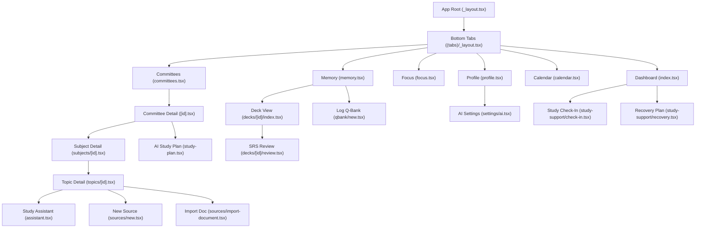

# MedOS Phase 11 UI/UX Audit & Information Architecture
**Post-Redesign Recovery & Strategic Assessment**

*Audit Baseline: Commit `27db327` (Post-Phase 10 Integrity Gate)*  
*Design Direction Locked: Clinical clarity + ADHD calmness + subtle academic-tech character (Light-First, Teal + Navy Accents, Minimalist / Shadcn-inspired)*

---

## 1. Current Screen Inventory

| Route / File | Purpose | Primary User Goal | Primary CTA | Secondary Actions | Major Sections | Shared UI Primitives | UX & Visual Issues |
| :--- | :--- | :--- | :--- | :--- | :--- | :--- | :--- |
| `app/(tabs)/index.tsx` | Main command center / Home | Immediate orientation: "What should I do now?" | Quick Start Focus / Review | Switch committee, view agenda, open settings | Greeting, Quick Start, Metrics (Today), Committee Hero, Momentum, Agenda | `Card`, `Button`, `StatCard`, `Badge`, `Typography` | High visual density; too many competing cards above the fold; dual-card metrics compete with quick start. |
| `app/(tabs)/committees.tsx` | Curriculum overview | View committees & progress | Open active committee | Create new committee, view status | Committee list grouped by active/upcoming/completed | `Card`, `Badge`, `Typography`, `Button` | Card border colors depend on user hex; lacks unified clinical card elevation; list density is high on small screens. |
| `app/committees/[id].tsx` | Committee hub | Manage subjects, exam date, & plan | View / Drill into Subject | Edit committee, Exam Plan, Study Plan, Delete | Hero countdown, Subject List, Analytics summary, Weak/Neglected topics, Evidence, Bottom Actions | `Card`, `Button`, `Badge`, `SectionHeader`, `Typography` | Bottom action card stacks multiple secondary CTAs; analytics section adds vertical bloat. |
| `app/committees/new.tsx` | Committee creation | Create a new exam block | Save Committee | Cancel, pick dates, select color | Form fields (Name, description, dates, color picker) | `Input`, `FormField`, `Button`, `Typography` | Floating form inputs without card container; custom color picker palette feels uncalibrated. |
| `app/committees/edit/[id].tsx` | Committee edit | Update dates or title | Save Changes | Cancel, change dates | Edit form fields | `Input`, `FormField`, `Button`, `Typography` | Same form inconsistencies as create screen. |
| `app/committees/exam-plan/[id].tsx` | Exam strategy view | Review exam readiness & target schedule | Adjust plan targets | Back to committee | Readiness metrics, subject breakdown | `Card`, `Button`, `Typography` | Dense tabular presentation; lacks light-first high-contrast card styling. |
| `app/committees/[id]/study-plan.tsx` | AI study planning | Generate & review tailored study block | Generate Study Plan | Apply plan, dismiss recommendations | AI recommendation banner, subject time allocations, evidence source tags | `Card`, `Button`, `Badge`, `Typography` | AI output formatting needs clearer distinction between draft recommendations and finalized calendar commitments. |
| `app/subjects/new.tsx` | Subject creation | Add subject to committee | Save Subject | Cancel | Title, description, target hours | `Input`, `FormField`, `Button`, `Typography` | Uncontained inputs; lacks breadcrumb context of parent committee. |
| `app/subjects/[id].tsx` | Subject detail | View topics and evidence | Drill into Topic | Add Topic, Edit Subject, Delete | Breadcrumb, Overview Card, Topic List, Learning Evidence, Danger Zone | `Breadcrumb`, `Card`, `Button`, `Badge`, `Typography` | Redesigned in 27db327; clean hierarchy, but topic items could be more compact. |
| `app/subjects/edit/[id].tsx` | Subject edit | Update subject metadata | Save Changes | Cancel | Edit form | `Input`, `FormField`, `Button`, `Typography` | Lacks breadcrumb context. |
| `app/topics/new.tsx` | Topic creation | Add topic under subject | Save Topic | Cancel | Title, importance, estimated hours | `Input`, `FormField`, `Button`, `Typography` | Form layout needs card containment and consistent label sizing. |
| `app/topics/[id].tsx` | Topic detail & hub | Study topic, view sources & Q-Bank | Start Focus Session | Log Q-Bank, Open Assistant, Add Source, Delete | Breadcrumb, Overview, Focus Action Card, Q-Bank Evidence, Review Evidence, Study Sources, Danger Zone | `Breadcrumb`, `Card`, `Button`, `Badge`, `Typography` | Redesigned in 27db327; information-rich, but vertical scroll is long; actions can be consolidated. |
| `app/topics/edit/[id].tsx` | Topic edit | Update topic metadata | Save Changes | Cancel | Edit form | `Input`, `FormField`, `Button`, `Typography` | Basic form layout. |
| `app/topics/[id]/sources/new.tsx` | Create text source | Paste or write study notes | Save Source | Cancel | Title, content textarea, source type selector | `Input`, `FormField`, `Button`, `Card` | Needs clear indication of grounded usage in AI downstream. |
| `app/topics/[id]/sources/import-document.tsx` | Document file ingestion | Import PDF / TXT file | Select File & Import | Cancel, retry | Document picker, file metadata preview, extraction state | `Card`, `Button`, `Badge`, `ProgressBar`, `Typography` | Extraction progress states need calm clinical feedback without jarring spinners. |
| `app/topics/[id]/sources/[sourceId].tsx` | Study source viewer | Read source material & notes | Open in Assistant | Edit source, Delete source | Source header, markdown/text viewer, metadata | `Card`, `Button`, `Typography` | Reader surface needs generous typography padding and high-contrast text. |
| `app/topics/[id]/assistant.tsx` | AI Study Assistant | Generate explanations, summaries, cards | Run Action (Explain/Summarize) | Select source, choose mode, toggle drafts, import to deck | Source selector, Action mode tabs, query input, draft card list, deck picker | `Card`, `Button`, `Badge`, `Input`, `Typography` | Very dense multi-step screen; tab selector competes with action buttons; draft review needs cleaner checkbox controls. |
| `app/(tabs)/focus.tsx` | Active & Idle Focus Timer | Execute distraction-free study session | Start Focus (Idle) / Pause (Active) | Pick duration, select committee, "I got distracted", Finish | Timer display, committee picker, duration picker, gentle return modal, history | `Card`, `Button`, `Badge`, `Typography` | Active mode is calm, but idle mode stacks two pickers and history on one screen. |
| `app/study-support/check-in.tsx` | Daily mental & study check-in | Quick reflection & momentum reset | Complete Check-In | Skip, change rating | Mood/energy pills, focus reflection, gentle suggestion | `Card`, `Button`, `Typography` | Clean ADHD tool; needs light-first card styling. |
| `app/study-support/recovery.tsx` | Recovery plan | Lighter study load after break | Accept Recovery Plan | Adjust targets, resume normal | Recovery rationale, reduced review batch, encouragement | `Card`, `Button`, `Badge`, `Typography` | Good low-cognitive-load screen. |
| `app/(tabs)/memory.tsx` | Decks & SRS overview | Check due cards & start review | Start Due Review | Create Deck, Log Q-Bank, inspect deck | Deck stat cards, Deck grid, Recent reviews | `Card`, `Button`, `StatCard`, `Badge`, `Typography` | Q-Bank button awkwardly placed between stats and deck grid; due count needs higher prominence. |
| `app/decks/new.tsx` | Create flashcard deck | Set up new card group | Create Deck | Cancel, link committee | Deck name, description, committee picker | `Input`, `FormField`, `Button`, `Card` | Uncontained inputs. |
| `app/decks/[id]/index.tsx` | Deck detail & card list | Manage flashcards in deck | Review Deck | Add Card, Edit Deck, Delete Deck | Header, study stats, card list | `Card`, `Button`, `Badge`, `Typography` | Card list lacks virtualization for large decks; search/filter missing. |
| `app/decks/[id]/edit.tsx` | Edit deck metadata | Update deck name/desc | Save Changes | Cancel | Form fields | `Input`, `FormField`, `Button` | Basic form layout. |
| `app/decks/[id]/review.tsx` | SRS Flashcard Review session | Answer & rate due cards | Show Answer / Rate (Again/Hard/Good/Easy) | Close session, view progress | Top progress bar, flashcard question/answer, rating bar | `Card`, `Button`, `ProgressBar`, `Typography` | Distraction-free review; rating buttons need subtle tactile feedback without aggressive colors. |
| `app/decks/[id]/cards/new.tsx` | Create flashcard | Add single flashcard | Save Card | Cancel, link topic | Front input, back input, topic picker | `Input`, `FormField`, `Button`, `Card` | Form layout needs clear card containment. |
| `app/decks/[id]/cards/[cardId]/edit.tsx` | Edit flashcard | Modify question or answer | Save Card | Cancel, Delete Card | Front input, back input | `Input`, `FormField`, `Button` | Basic form layout. |
| `app/qbank/new.tsx` | Log Q-Bank session | Record question practice results | Save Session | Cancel, select topic | Questions input, correct input, live preview card, duration, source name, topic link | `Card`, `Button`, `Badge`, `ProgressBar`, `FormField`, `Input` | Redesigned in 27db327 with live preview; form is clean, but number inputs could offer quick +/- steppers. |
| `app/(tabs)/calendar.tsx` | Calendar & agenda | Inspect study timeline | Select date / Add event | Month navigation, jump to today | Month grid card, Day agenda list | `Card`, `Button`, `Typography` | Calendar takes up a full tab bar slot; agenda card could be tighter. |
| `app/calendar/new.tsx` | Add calendar event | Schedule study or exam | Save Event | Cancel | Title, date/time pickers, type selector | `Input`, `FormField`, `Button` | Form fields float without containment. |
| `app/calendar/[id].tsx` | Calendar event detail | View event details | Edit Event | Delete, Back | Event card, linked committee/deck info | `Card`, `Button`, `Badge` | Functional detail screen. |
| `app/calendar/[id]/edit.tsx` | Edit calendar event | Update event timing | Save Changes | Cancel | Form fields | `Input`, `FormField`, `Button` | Basic form layout. |
| `app/(tabs)/profile.tsx` | Settings & Preferences | Manage language, focus, & AI settings | Adjust preference | Open AI settings, view storage info | Focus preferences card, Study support card, Language card, AI integration card, Local storage card | `Card`, `Button`, `Typography` | Well-grouped in 27db327; toggle switches and radio pills are clear and accessible. |
| `app/settings/ai.tsx` | AI Provider configuration | Choose provider & set API key | Save AI Settings | Test Connection, toggle provider | Provider segmented control, API key input, status badge, model selection | `Card`, `Button`, `Badge`, `Input`, `Typography` | SecureStore integration is clean; needs light-first card styling. |
| `app/+not-found.tsx` | Route fallback | Return to home | Go to Home | None | Centered 404 message | `Button`, `Typography` | Clean fallback screen. |

---

## 2. Current Navigation Map



### Navigational Observations:
1. **Tab Overload**: 6 bottom tabs (`Home`, `Committees`, `Focus`, `Memory`, `Calendar`, `Profile`) exceed the ideal 4–5 tab limit for mobile screens, squeezing touch targets.
2. **Deep Curriculum Hierarchy**: `Committees → Subject → Topic → Source / Assistant` is 4 levels deep; users need strong visual breadcrumbs to maintain spatial orientation.
3. **Q-Bank Entry Point**: Currently reachable via `Memory` tab button and `Topic` detail screen; lacks its own top-level summary.
4. **Calendar Redundancy**: Calendar exists both as a full bottom tab and as an agenda component on the Home screen.

---

## 3. Existing Phase 11 Work Assessment (`27db327`)

| File / Component | Classification | Detailed Rationale & Action |
| :--- | :--- | :--- |
| `theme/colors.ts` | **KEEP BUT REFINE** | Solid semantic foundation (`successMuted`, `errorMuted`, `LightColors`), but primary brand is currently violet (`#6C63FF`/`#5850EC`). Must be refined to the locked **Teal + Navy clinical palette** (`teal` primary, `deep navy` surfaces/accents). |
| `theme/spacing.ts` | **KEEP AS IS** | Clean 4pt grid rhythm (2, 4, 8, 16, 24, 32, 48, 64) and radius scale (4, 6, 12, 16, 24, pill: 9999). Fits medical productivity UI. |
| `theme/typography.ts` | **KEEP BUT REFINE** | Good semantic scale (`display`, `h1`, `h2`, `h3`, `subhead`, `body`, `caption`, `stat`). Refine font weight pairings for high contrast readability in light mode. |
| `hooks/useTheme.ts` | **KEEP AS IS** | Centralized, reactive theme resolution with `colorScheme` and `isDark`. |
| `components/ui/Breadcrumb.tsx` | **KEEP AS IS** | Essential for curriculum hierarchy (`Committee > Subject > Topic`). Touch targets and chevron dividers work well. |
| `components/ui/StatCard.tsx` | **KEEP AS IS** | Clean metric container with label, value, subvalue, and icon. |
| `components/ui/ProgressBar.tsx` | **KEEP AS IS** | Accessible linear indicator with `accessibilityRole="progressbar"`. |
| `components/ui/SectionHeader.tsx`| **KEEP AS IS** | Title + subtitle + optional badge/action. |
| `components/ui/SegmentedControl.tsx`| **KEEP AS IS** | Accessible pill-style switcher for light/dark or AI modes. |
| `components/ui/Divider.tsx` | **KEEP AS IS** | Inset/full-bleed separator. |
| `components/ui/EmptyState.tsx` & `ErrorState.tsx` | **KEEP AS IS** | Clean standardized feedback states. |
| `components/ui/Card.tsx` | **KEEP BUT REFINE** | Remove heavy dark-mode borders when in light mode; replace with soft clinical surface colors and 1px subtle borders (`#E2E8F0`). |
| `components/ui/Button.tsx` | **KEEP BUT REFINE** | Align variants (`primary`, `secondary`, `outline`, `ghost`, `danger`) to the new teal/navy palette. |
| `components/ui/Badge.tsx` | **KEEP BUT REFINE** | Reduce padding and font weight slightly to prevent visual clutter in list rows. |
| `app/(tabs)/index.tsx` | **KEEP BUT REFINE** | Reordered metrics and quick start in 27db327, but needs further reduction of visual noise (fewer borders, lighter cards). |
| `app/subjects/[id].tsx` | **KEEP AS IS** | Clean breadcrumb, overview card, learning evidence, and isolated danger zone. |
| `app/topics/[id].tsx` | **KEEP BUT REFINE** | Clean hierarchy, but consolidate action buttons to prevent vertical stretching. |
| `app/committees/[id].tsx` | **KEEP BUT REFINE** | Bottom action cards and planning buttons should be consolidated into one unified actions card. |
| `app/qbank/new.tsx` | **KEEP AS IS** | Live accuracy preview and breakdown card works exceptionally well. |
| `scripts/validate-phase11.cjs` | **KEEP AS IS** | Robust architectural validator checking design tokens, primitives, screens, and Phase 9/10 regression. |

---

## 4. Design System Audit

### Colors
- **Semantic Completeness**: Full coverage for background, surface, surfaceElevated, surfaceHighlight, border, primary, accent, textPrimary, textSecondary, textMuted, textInverse, success, warning, error, info.
- **Palette Realignment Needed**: The current theme relies on violet (`#6C63FF`). The locked design direction requires **Light-first clinical clarity with Teal (`#0D9488` / `#14B8A6`) and Deep Navy (`#0F172A` / `#1E293B`)**.
- **Dark Mode**: Currently pure black (`#0D0F14`). Should be refined to **charcoal/navy premium alternative** (`#0B0F19` / `#111827`) to maintain medical professionalism.

### Typography
- **Hierarchy**: Strong differentiation from `stat` (32pt bold) down to `caption` (11pt).
- **Legibility**: High tabular numeral legibility for timer and analytics.
- **Font Stack**: System sans (San Francisco / Roboto), future-proofed for Inter.

### Spacing & Radius
- **Spacing Rhythm**: 4pt/8pt grid rhythm is strictly enforced.
- **Radius**: Restrained corner rounding (`md: 12`, `lg: 16`, `pill: 9999`). Avoids excessive bubbly rounding.

### Shadows & Elevation
- Minimal use of elevation shadows. Uses clean 1px border contrast (`#E2E8F0` light, `#1E293B` dark) to maintain clinical cleanliness without Material design shadows.

---

## 5. Shared Component Audit

| Component | Status | Theme Safety | Accessibility | Issues & Refinement Actions |
| :--- | :--- | :--- | :--- | :--- |
| `Typography` | KEEP | Safe | Safe | Ensure contrast ratio >= 4.5:1 for `caption` and `bodySmall` in light mode. |
| `Button` | REFINE | Safe | Safe | Primary button should use teal/navy; add active opacity `0.85`; enforce minimum height 44pt. |
| `IconButton` | KEEP | Safe | Safe | Guaranteed 44×44pt hit area with centered icon. |
| `Card` | REFINE | Safe | Safe | Ensure light theme background is crisp white (`#FFFFFF`) with subtle border (`#E2E8F0`), not murky gray. |
| `StatCard` | KEEP | Safe | Safe | Clean stat display with subvalue. |
| `Badge` | REFINE | Safe | Safe | Ensure muted background colors (`successMuted`, `infoMuted`) have high text contrast. |
| `ProgressBar` | KEEP | Safe | Safe | Contains `accessibilityRole="progressbar"`, `accessibilityValue`. |
| `SectionHeader`| KEEP | Safe | Safe | Good subtitle hierarchy and action button placement. |
| `SegmentedControl`| KEEP | Safe | Safe | Pill-shaped selection with accessible radio semantics. |
| `Divider` | KEEP | Safe | Safe | Supports horizontal/vertical and inset layouts. |
| `Breadcrumb` | KEEP | Safe | Safe | Clean interactive crumb trail. |
| `EmptyState` | KEEP | Safe | Safe | Standardized empty view with icon, title, description, and action button. |
| `ErrorState` | KEEP | Safe | Safe | Non-intrusive error container with retry action. |
| `Input` / `FormField`| REFINE | Needs Audit | Safe | Wrap standard text inputs in consistent card-like surfaces with clear focus ring. |

---

## 6. Information Architecture Problems

1. **Information Overload on Home**: The Dashboard attempts to serve as a curriculum browser, calendar widget, momentum tracker, and metrics dashboard simultaneously.
2. **Competing Actions for the ADHD Mind**: When landing on the home screen, students face 4–5 different primary-style buttons. There must be **one clear "What should I do now?" primary action**.
3. **Curriculum Depth Disconnection**: In deep hierarchy (`Committee > Subject > Topic`), users easily lose track of the overarching exam date and target completion.
4. **Scattered Q-Bank Access**: Q-Bank logging is tucked away inside Memory and Topic screens rather than having an intuitive, consistent presence.
5. **AI Separation vs Subordination**: Study Assistant previously felt like a detached chat screen; it must feel like a focused study workbench directly grounded in the student's chosen topic notes.

---

## 7. Dashboard Audit

### Current Module Inventory:
- **Greeting / User Header**: Compact, friendly. *(KEEP COMPACT)*
- **Partial Error Notification**: Banner shown only on fetch failure. *(KEEP COMPACT)*
- **QuickStartCard ("What should I do now?")**: Primary CTA based on priority rules. *(KEEP PROMINENT)*
- **MetricsGrid (Today's Progress)**: Focus minutes, Cards reviewed, Questions solved. *(KEEP COMPACT)*
- **Active Committee Hero Card**: Countdown to exam date & days remaining. *(KEEP PROMINENT)*
- **MomentumCard**: Streak / study habit status. *(KEEP COMPACT)*
- **Day Agenda List**: Events scheduled for today. *(MERGE / KEEP COMPACT)*

### Target Home Hierarchy:
1. **Header**: Contextual greeting + active Committee pill with days remaining.
2. **Hero Action Card**: "What should I do now?" (Single clear high-contrast CTA).
3. **Today's Rhythm (Compact Stats)**: 3-column row (Focus min, Due reviews, Q-Bank accuracy).
4. **Needs Attention (If any)**: Weak topic warning or due review prompt.
5. **Today's Agenda**: Clean list of today's study blocks.

---

## 8. Curriculum Audit (`Committee → Subject → Topic`)

- **Hierarchy Clarity**: `Breadcrumb` navigation introduced in `27db327` successfully eliminated navigation blindness.
- **Progress Tracking**: Subject and Topic cards now display completed vs remaining counts.
- **List Density**: Long subject lists should use compact rows with progress pills rather than heavy full-width cards.
- **Danger Zones**: Destructive actions (delete committee, subject, topic) are safely isolated into distinct bottom danger cards with red accents and confirmation alerts.

---

## 9. Memory & SRS Workflow Audit

- **Review Initiation**: Prominent "Start Due Review" action is critical. When 0 cards are due, the empty state must clearly convey "All caught up!" with a calm, affirming tone.
- **Flashcard Review Screen (`app/decks/[id]/review.tsx`)**:
  - Distraction-free full screen.
  - Progress bar at top.
  - Card flip action on tap.
  - Rating controls (`Again`, `Hard`, `Good`, `Easy`) at bottom with comfortable thumb reach.
- **Deck Management**: Deck creation and card editing forms should be contained in neat cards with clear front/back inputs.

---

## 10. Focus Workflow Audit

- **Idle State**: Duration picker, Committee picker, and Start button are currently stacked. Needs visual grouping: a single setup card with a large high-contrast Start button.
- **Active State (`app/(tabs)/focus.tsx`)**:
  - Very calm and low-distraction.
  - Large tabular numeral timer display.
  - Centered topic badge.
  - Secondary controls ("I got distracted", Gentle Return) are muted to avoid competing with the timer.
  - Low-stimulation mode strips unnecessary borders and animations.

---

## 11. Q-Bank Workflow Audit

- **Rapid Entry (`app/qbank/new.tsx`)**:
  - Live calculation preview card (Questions, Correct, Incorrect, Accuracy %, visual progress bar) drastically reduces entry friction.
  - Validations prevent illogical inputs (e.g. correct > total) with clear inline error messages.
- **Evidence Separation**: Evidence is strictly recorded in SQLite (`qbank_sessions`) without fabricating AI summaries or unverified statistics.

---

## 12. Analytics Workflow Audit

- **Weak & Neglected Topics**: Highlighted cleanly using deterministic rules from Phase 9.
- **Factual Integrity**: Zero speculative predictions, fake exam pass percentages, or psychological assessments. Purely factual: accuracy rate, questions practiced, retention rate, days since practice.

---

## 13. AI Workflow Audit

- **Source Grounding**: Explicitly indicates which Study Source is being queried.
- **Visual Separation**:
  - Source Content: Clinical neutral card with excerpt quotation marks.
  - AI Drafts: Ephemeral badge, front/back inputs, editable draft indicator.
  - Approved Content: Explicit button to import approved flashcards into user's chosen Deck.
- **No Unearned Certainty**: Clear disclaimer that AI drafts are generated suggestions requiring student verification.

---

## 14. Theme Readiness

- **Light Mode**: Supported via `LightColors`. Needs tuning for clinical crispness (pure white surface `#FFFFFF`, soft cool slate background `#F8FAFC`, subtle border `#E2E8F0`, teal primary `#0D9488`, deep navy text `#0F172A`).
- **Dark Mode**: Supported via `DarkColors`. Needs tuning for premium charcoal/navy aesthetic (`#0B0F19` background, `#111827` surface, `#1E293B` border, teal accent `#14B8A6`).
- **System Theme Switching**: Managed reactively via `hooks/useTheme.ts` listening to system/preference changes.

---

## 15. Responsive Layout Risks

- **Phone Portrait**: Narrow screens (e.g. 360px width) risk button text wrapping if action buttons sit side-by-side. Buttons must flex or stack gracefully.
- **Tablet Portrait & Landscape**: Multi-column layouts are supported via `useResponsive()`. Ensure hero containers use `maxWidth: 680` on large screens to prevent excessively wide text lines.
- **Virtual Keyboard**: Forms with multiple text inputs (e.g. Q-Bank, flashcard editor, assistant query) must be wrapped in `KeyboardAvoidingView` with bottom padding.

---

## 16. Accessibility Risks

- **Touch Targets**: All interactive elements (icon buttons, tab bar items, breadcrumb links, radio choices) must meet or exceed 44×44pt.
- **Color Contrast**: Verify all text variants against their backgrounds (minimum 4.5:1 for normal text, 3:1 for large display/stat text).
- **Localization Length**: Turkish translations are often 20–40% longer than English equivalents (e.g. "Add Source" vs "Çalışma Kaynağı Ekle"). UI containers must never use rigid fixed widths.
- **Screen Reader Semantics**: Ensure `accessibilityRole` (`button`, `radio`, `checkbox`, `progressbar`, `alert`) is specified across all interactive controls.

---

## 17. Proposed Future Information Architecture

```
[ MedOS Shell ]
│
├── Top App Bar: Active Committee Pill (with countdown) + Quick Check-In Icon
│
├── Primary Bottom Navigation (5 Core Tabs):
│   ├── 1. Dashboard (Home: What to do now + Today's Rhythm)
│   ├── 2. Curriculum (Committees → Subjects → Topics)
│   ├── 3. Focus (Timer + Distraction-free Study)
│   ├── 4. Memory (SRS Flashcard Decks + Q-Bank Practice)
│   └── 5. Profile (Preferences, ADHD Support, AI Settings)
│
└── Contextual Workflows (Modal / Stack Sheets):
    ├── Study Assistant & Ingestion (Opened from specific Topic)
    ├── Flashcard Review Session (Opened from specific Deck)
    ├── Q-Bank Session Logger (Opened from Memory or Topic)
    └── Calendar / Timeline (Contextual agenda view)
```

---

## 18. Recommended Screen Hierarchy

1. **Dashboard**: Orientation & single primary action first; compact metrics second; schedule third.
2. **Curriculum Screens**: Always display `Breadcrumb` at the top; overview metadata in top card; content items in clean compact rows; destructive operations at bottom in isolated Danger Zone.
3. **Session Screens (Focus / Review)**: Minimalist full-screen distraction-free mode; no tab bar visible; large timer / card text; thumb-accessible primary controls.
4. **Form Screens**: Contained within clean white/elevated cards; clear field labels; distinct primary save and secondary cancel buttons.

---

## 19. Existing UI: Keep / Refine / Rework Matrix

| Component / Screen | Status | Action Needed |
| :--- | :--- | :--- |
| `theme/colors.ts` | **REFINE** | Realign primary/accent tokens to Teal + Deep Navy clinical palette. |
| `theme/spacing.ts` | **KEEP** | Standard 4pt grid rhythm is locked and correct. |
| `theme/typography.ts` | **REFINE** | Tune font weight mappings for optimal contrast. |
| `components/ui/Breadcrumb.tsx` | **KEEP** | Keep as core navigation primitive. |
| `components/ui/StatCard.tsx` | **KEEP** | Standardize across Dashboard and Memory screens. |
| `components/ui/ProgressBar.tsx` | **KEEP** | Use across Q-Bank, Review, and Document import. |
| `components/ui/SectionHeader.tsx`| **KEEP** | Standardize section titling. |
| `components/ui/SegmentedControl.tsx`| **KEEP** | Use for mode switches and settings. |
| `components/ui/Card.tsx` | **REFINE** | Soften borders and optimize light-mode background. |
| `components/ui/Button.tsx` | **REFINE** | Align color tokens to teal/navy palette. |
| `components/ui/Badge.tsx` | **REFINE** | Tune padding and font sizes for high-density lists. |
| `app/(tabs)/_layout.tsx` | **REFINE** | Align tab bar active tint to teal; ensure 44pt touch area. |
| `app/(tabs)/index.tsx` | **REFINE** | Polish into light-first medical productivity home screen. |
| `app/subjects/[id].tsx` | **KEEP** | Hierarchy is clear and well-structured. |
| `app/topics/[id].tsx` | **REFINE** | Compact action buttons to reduce vertical scroll. |
| `app/committees/[id].tsx` | **REFINE** | Consolidate bottom planning cards. |
| `app/qbank/new.tsx` | **KEEP** | Form structure and live accuracy preview are optimal. |
| `app/(tabs)/focus.tsx` | **REFINE** | Clean up idle mode setup card layout. |
| `app/(tabs)/memory.tsx` | **REFINE** | Move Q-Bank button to secondary action row; highlight due counts. |
| `scripts/validate-phase11.cjs` | **KEEP** | Comprehensive Phase 11 structural validation gate. |

---

## 20. Phase 11 Execution Plan

- **Step 11.2: Design System Reconciliation**
  - Reconcile `theme/colors.ts` to Teal (`#0D9488`) + Navy (`#0F172A`) palette.
  - Calibrate `LightColors` as the primary aesthetic target and `DarkColors` as premium charcoal/navy.
  - Update `components/ui/` primitives to consume reconciled tokens cleanly.
- **Step 11.3: Shared Core Components Polish**
  - Polish `Card`, `Button`, `Badge`, `Input`, `FormField` states, focus rings, and touch targets.
- **Step 11.4: Global Shell + Navigation**
  - Polish bottom tab bar styling, safe areas, and active indicators.
- **Step 11.5: Dashboard Redesign**
  - Elevate "What should I do now?" CTA; compact Today's metrics into clean 3-stat row.
- **Step 11.6: Curriculum Redesign**
  - Align Committee, Subject, and Topic screens to the reconciled design system.
- **Step 11.7: Study Workflows Redesign**
  - Polish Focus idle setup, Memory due review prominence, and Q-Bank logging.
- **Step 11.8: AI Screens Redesign**
  - Refine Study Assistant, Source Ingestion, and Study Plan presentations.
- **Step 11.9: Light / Dark / Low-Stimulation Completion**
  - Audit high contrast, border clarity, and low-stimulation behavior across all routes.
- **Step 11.10: Responsive & Accessibility Polish**
  - Verify tablet widths, phone touch targets, screen reader labels, and Turkish string expansion.
- **Step 11.11: Final Visual QA & Regression Gate**
  - Execute full TypeScript checks, Phase 9, Phase 10, and Phase 11 validation scripts, and Android Expo build export.
